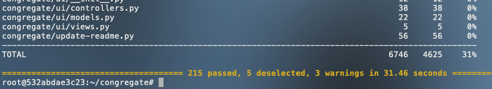

# Congregate

This file will help developers understand how to setup a congregate development environment. For general usability, check out the [user guide](using-congregate.md)

[[_TOC_]]

## About

* Congregate is a Professional Services utility for migrating one or more data sources into a single GitLab instance.
* Users are migrated using individual API endpoints.
* Congregate leverages both the [Project](https://docs.gitlab.com/ee/api/project_import_export.html) and [Group](https://docs.gitlab.com/ee/api/group_import_export.html) Export / Import API to migrate projects and groups.
  * Export / Import on the source and destination instance are bound by [rate limit settings](https://docs.gitlab.com/ee/api/README.html#rate-limits).
  * [Other important notes](https://docs.gitlab.com/ee/user/project/settings/import_export.html#important-notes) for Project import/export
  * [Other important notes](https://docs.gitlab.com/ee/user/group/settings/import_export.html#important-notes) for Group import/export
  * Depending on the GL version [immediate project and group deletion permissions](https://about.gitlab.com/handbook/support/workflows/hard_delete_project.html) may vary.
* Missing project and group Export/Import features are migrated using individual API endpoints.
* You can read more about how Congregate contributes to our overall migration strategy on the [Importers direction page](https://about.gitlab.com/direction/manage/importers/#consuming-import-capabilities).
* Importer epics:
  * [Importer Portfolio Epic](https://gitlab.com/groups/gitlab-org/-/epics/2720)
  * [Importers Strategy](https://gitlab.com/groups/gitlab-org/-/epics/2721)
  * [GitLab Group Export/Import bugs](https://gitlab.com/groups/gitlab-org/-/epics/4614)
  * [GitLab Project Export/Import bugs](https://gitlab.com/groups/gitlab-org/-/epics/3054)
  * [Bitbucket Importer bugs](https://gitlab.com/groups/gitlab-org/-/epics/5514)
  * [GitHub Importer bugs](https://gitlab.com/groups/gitlab-org/-/epics/3050)
* Congregate will not be ported into the GitLab application as-is, but certain pieces of existing Congregate functionality will be rebuilt in GitLab, which remains focused on self-service migrations. To track this work, please visit the [GitLab Group Migration](https://gitlab.com/groups/gitlab-org/-/epics/2901) epic.

## Migration features

[List and overview of Migration Features](./migration-features.md)

## Dependencies

* Python 3.8
* [AWS CLI](https://aws.amazon.com/cli/)
* [Poetry](https://python-poetry.org/)
* [Node v12.18.4](https://www.npmjs.com/)

## Setup

### TL;DR Install

This document assumes you have a working python 3.8.5 or greater installed, you know how to clone a repo in terminal, and switch to its directory.  If you do not have a working python, you will need to take appropriate OS specific steps to install it.

After cloning [the repo](https://gitlab.com/gitlab-com/customer-success/professional-services-group/global-practice-development/migration/congregate) and changing to the directory in terminal, run the following appropriate commands to run your first UT!

1. For Mac users, using `brew`:
   1. `brew update`
   2. Upgrade to `python@3.8`: `brew upgrade python@3.8`
   3. Restart terminal or open separate tab (shell)
   4. `pip3 install poetry`
   5. `pip3 -V` (e.g. `pip 20.1.1 from /usr/local/lib/python3.8/site-packages/pip (python 3.8)`)
   6. `poetry -V` (e.g. `Poetry version 1.0.9`)
   7. `python -V` Currently congregate only works in Python 3. Your python needs to be `Python 3.8.5` or greater.
   8. In case of multiple poetry virtualenvs (`<HOME>/Library/Caches/pypoetry/virtualenvs/`), perform the following steps to set Python 3 as the active one:
      1. Set your Python to point (via `~/.bashrc` alias or symlink) to Python 3
      2. Run `poetry env use python3.8` (`python2.7` when reverting back to Python 2)
      3. Run `poetry install -v` (resolves the `pyproject.toml` dependencies, and installs the versions specified in the `poetry.lock` file)

      **NOTE:** By removing the `poetry.lock` file or running `poetry update` you are deviating from the default set versions of the dependencies. When in doubt add `--no-dev` (Do not install dev dependencies) and `--dry-run` (`poetry update` only) to avoid dev dependencies i.e. inspect new versions before updating to them.
1. Install the python poetry virtual environment manager: `pip install poetry` If pip install poetry doesn't work: \
 `curl -sSL https://raw.githubusercontent.com/python-poetry/poetry/master/get-poetry.py | python`
1. Source the poetry environment: `source $HOME/.poetry/env`
1. Verify poetry works: `poetry --version`. If this doesn't work, add the following line to your appropriate rc file, usually `.zshrc`: \
`export PATH=$HOME/.poetry/bin:$PATH` and retry `poetry --version`
1. Install python dependencies `poetry install`
   1. To update dependencies run `poetry update`
1. Install NVM for Node Version Management \
 `curl -o- https://raw.githubusercontent.com/nvm-sh/nvm/v0.35.3/install.sh | bash`
1. If you are using zsh (mac default) copy this into `.zshrc`.  If not, copy into `.bashrc`.  Both of these files are generally found at `~/` \
`export NVM_DIR="$HOME/.nvm"` \
`[ -s "$NVM_DIR/nvm.sh" ] && \. "$NVM_DIR/nvm.sh"  # This loads nvm` \
`[ -s "$NVM_DIR/bash_completion" ] && \. "$NVM_DIR/bash_completion"  # This loads nvm bash_completion`
1. Source whatever filed you copied the lines into. i.e.; `source .zshrc`
1. Install nvm: `nvm install 11.13.0`
1. Use specific nvm version: `nvm use 11.13.0`
1. Install UI dependencies: `npm install`
1. Create congregate path: `CONGREGATE_PATH=$(pwd)`
1. Copy congregate script to a bin directory: `cp congregate.sh /usr/local/bin/congregate`
1. Initialize additional congregate directories \
`congregate init` \
`echo "export CONGREGATE_PATH=$CONGREGATE_PATH" >> ~/.bash_profile`

#### Congratulations

If we made it this far without errors, we are done with the basic install for development! The next bash command will run the UT and verify your installation is working.  This command could be pulled from the [.gitlab-ci.yml](.gitlab-ci.yml) or the `pt` alias in [./dev/bin/env](dev/bin/env).

```bash
poetry run pytest -m 'unit_test' --cov-report html --cov-config=.coveragerc --cov=congregate congregate/tests/
```

Success looks like;


**NOTE:** Warnings should not be ignored, as they may cause the remote unit test job to fail. To easily discover and allow warnings comment out the following line in `congregate/tests/pytest.ini`:

```python
filterwarnings = error
```

## Configuring Congregate

Once all of the dependencies are installed, run `congregate configure` to set up the Congregate config. Alternatively, you can copy the config that you need from the [config template](congregate.conf.template)

### Config staging location

The only fully supported method for both group and project export / import is:

* **filesystem** - export, download and import data locally.

The following method is supported only for project export / import:

* **aws** - export and download data directly to an S3 bucket and import directly from the S3 bucket.
  * AWS (S3) user attributes are **not yet** available on the Group export / import API.

The following method may be supported in the future ([issue](https://gitlab.com/gitlab-com/customer-success/professional-services-group/global-practice-development/migration/congregate/issues/119)):

* **filesystem-aws** - export and download data locally, copy it to an S3 bucket for storage, then delete the data locally. Copy the data back from S3, import it and then delete the local data again.
  * This is used to help work with company policies like restricting presigned URLs or in case any of the source instances involved in the migration cannot connect to an S3 bucket while the destination instance can.

### Install & Use Poetry and Node (required for end-user and development setups)

```bash

# Install poetry with different OSs

# osx/Linux/bash on Windows Install Instructions
curl -sSL https://raw.githubusercontent.com/python-poetry/poetry/master/get-poetry.py | python

# windows powershell Install Instructions
Invoke-WebRequest -Uri https://raw.githubusercontent.com/python-poetry/poetry/master/get-poetry.py -UseBasicParsing).Content | python

# Install with pip
pip install poetry

# Install dependencies from Pipfile
cd <path_to_congregate>
poetry install

# Start-up python virtualenv
cd <path_to_congregate>
poetry shell

# Install NVM for managing node versions
curl -o- https://raw.githubusercontent.com/nvm-sh/nvm/v0.35.3/install.sh | bash
nvm install 12.18.4
nvm use 12.18.4

# Install ui dependencies
cd <path_to_congregate>
npm install
```

### Installing and configuring Congregate (end-user)

#### From docker

1. Pull the docker image from the container registry
    * For official versioned releases, `docker pull registry.gitlab.com/gitlab-com/customer-success/professional-services-group/global-practice-development/migration/congregate:<version>`
    * For rolling releases, `docker pull registry.gitlab.com/gitlab-com/customer-success/professional-services-group/global-practice-development/migration/congregate:rolling-debian`
2. For proper DNS mapping make sure to add the source, destination and proxy IP (or hostname) to the VM and docker container `/etc/hosts` file, e.g.:

  ```bash
  127.0.0.1 localhost
  192.168.1.1 source.instance.org
  ```

3. Login to the migration VM using `ssh -L 8000:localhost:8000 <vm_alias_ip_or_hostname>` to expose the Congregate UI outside of the docker container
4. Run the following command:

```bash
docker login registry.gitlab.com/gitlab-com/customer-success/professional-services-group/global-practice-development/migration/congregate -u <user name> -p <personal token>
docker run \
--name <name> \
-v /var/run/docker.sock:/var/run/docker.sock \ # expose docker socket as volume
-v <path_to_local_data>:/opt/congregate/data \ # expose data directory as volume
-v <path_to_local_downloads>:/opt/congregate/downloads \ # if migrating from GitLab expose downloads directory as volume
-p 8000:8000 \ # expose UI port
-it registry.gitlab.com/gitlab-com/customer-success/professional-services-group/global-practice-development/migration/congregate:<version> \
/bin/bash
./congregate.sh configure
./congregate.sh list
```

##### Additional settings (for private networks behind proxy)

* For `docker run`:
  * `-e http_proxy="$http_proxy" -e https_proxy="$https_proxy" -e no_proxy="$no_proxy" -e HTTP_PROXY="$http_proxy" -e HTTPS_PROXY="$https_proxy"`
  * `-e REQUESTS_CA_BUNDLE="/etc/pki/tls/certs/ca-bundle.crt"`
  * `-v /etc/pki/ca-trust/source/anchors/:/etc/pki/ca-trust/source/anchors/`
  * `-v /etc/hosts:/etc/hosts`
* Run `update-ca-trust extract` in the docker container once started to load the certificates from `anchors` into `ca-bundle.crt`

To resume the container:

```bash
docker start <container-id>
docker exec -it <container-id> /bin/bash
```

**N.B.** To bring up docker aliases and others run:

`. dev/bin/env`

#### From tar.gz

1. Navigate to the project's *Repository -> Files* page
2. Download the latest tar.gz
3. Run the following commands:

```bash
tar -zxvf congregate-${version}.tar.gz
export CONGREGATE_PATH=<path_to_congregate>
cp congregate.sh /usr/local/bin
```

#### From source

1. Clone this repo
2. Run the following commands:

```bash
cd <path_to_congregate>
export CONGREGATE_PATH=<path_to_congregate>
cp congregate.sh /usr/local/bin
```

#### Configuring

Before you start make sure to have a source and destination instance(s) available and accessible from Congregate. To do this run a `curl -k <source-hostname>` and `curl -k <destination-hostname>` to make sure they are routable. You can leave off -k if SSL certs are configured correctly.

Using the `root` user account create a Personal Access Token or PAT (preferably create a separate user with Admin privileges) on both instances.
In Gitlab, from the user profile's *Settings -> Access Tokens* enter a name and check `api` from *Scopes*. *Note: This may change once more granular rights are introduced for PATs as described [here](https://gitlab.com/groups/gitlab-org/-/epics/637).*
Make sure to safely store the tokens before configuring.

> if you are configuring `data/congregate.conf` without using `congregate configure` make sure to base64 encode the tokens by using the `congregate obfuscate` utility. It will prompt you to paste the token in and spit out the encoded token. 

As part of project migrations Congregate extends the Project export/import API by migrating registries (docker images).
Make sure to enable the **Container Registry** on both instances as you will need the hostnames during configuration.
Apart from the `/etc/gitlab/gitlab.rb` file you may lookup the hostname on an empty project's *Packages -> Container Registry* page.

Run the following commands to configure Congregate and retrieve info from the source instance:

```bash
./congregate.sh configure
./congregate.sh list
```

To enable Slack alerting (via [Incoming Webhooks](https://api.slack.com/messaging/webhooks)) configure the `slack_url`. This way the `ERROR` and `WARNING` logs will be also sent to a dedicated Slack channel.

All secrets (PATs, S3 keys) are obfuscated in your `congregate.conf` configuration file.

With Congregate configured and projects, groups, and users retrieved, you should be ready to use the tool or test your changes.

**N.B.** Instead of exporting an environment variable within your shell session, you can also add `CONGREGATE_PATH` to `bash_profile` or an `init.d` script. This is a bit more of a permanent solution than just exporting the variable within the session.

### Usage

Make sure to check out our [user guide](using-congregate.md) if you're just getting started to learn the basics. 

``` text
Usage:
    congregate init
    congregate list [--processes=<n>] [--partial] [--skip-users] [--skip-groups] [--skip-projects] [--skip-ci] [--src-instances]
    congregate configure
    congregate generate-reporting
    congregate stage-projects <projects>... [--skip-users] [--commit] [--scm-source=hostname]
    congregate stage-groups <groups>... [--skip-users] [--commit] [--scm-source=hostname]
    congregate stage-wave <wave> [--commit] [--scm-source=hostname]
    congregate create-stage-wave-csv [--commit]
    congregate migrate [--processes=<n>] [--reporting] [--skip-users] [--skip-adding-members] [--skip-group-export] [--skip-group-import] [--skip-project-export] [--skip-project-import] [--only-post-migration-info] [--subgroups-only] [--scm-source=hostname] [--commit] [--reg-dry-run]
    congregate rollback [--hard-delete] [--skip-users] [--skip-groups] [--skip-projects] [--commit]
    congregate ui
    congregate do-all [--commit]
    congregate do-all-users [--commit]
    congregate do-all-groups-and-projects [--commit]
    congregate search-for-staged-users [--table]
    congregate update-aws-creds
    congregate add-users-to-parent-group [--commit]
    congregate remove-inactive-users [--commit] [--membership]
    congregate update-user-permissions [--access-level=<level>] [--commit]
    congregate get-total-count
    # TODO: Refactor, project name matching does not seem correct
    congregate find-unimported-projects [--commit]
    congregate stage-unimported-projects [--commit] # TODO: Refactor, broken
    congregate remove-users-from-parent-group [--commit]
    congregate migrate-variables-in-stage [--commit]
    congregate mirror-staged-projects [--commit]
    congregate remove-all-mirrors [--commit]
    # TODO: Add dry-run, potentially remove
    congregate update-projects-visibility
    congregate set-default-branch [--commit]
    congregate enable-mirroring [--commit] # TODO: Find a use for it or remove
    congregate count-unarchived-projects [--local]
    congregate archive-staged-projects [--commit] [--scm-source=hostname]
    congregate unarchive-staged-projects [--commit] [--scm-source=hostname]
    congregate filter-projects-by-state [--commit] [--archived]
    congregate find-empty-repos
    congregate compare-groups [--staged]
    congregate staged-user-list
    congregate generate-seed-data [--commit] # TODO: Refactor, broken
    congregate validate-staged-groups-schema
    congregate validate-staged-projects-schema
    congregate map-users [--commit]
    congregate map-and-stage-users-by-email-match [--commit]
    congregate generate-diff [--processes=<n>] [--staged] [--rollback] [--scm-source=hostname] [--skip-users] [--skip-groups] [--skip-projects] [--subgroups-only]
    congregate clean [--commit]
    congregate stitch-results [--result-type=<project|group|user>] [--no-of-files=<n>] [--head|--tail]
    congregate obfuscate
    congregate deobfuscate
    congregate dump-database
    congregate reingest <assets>...
    congregate clean-database [--commit] [--keys]
    congregate toggle-maintenance-mode [--commit] [--off] [--dest] [--msg=<multi+word+message>]
    congregate ldap-group-sync <file-path> [--commit]
    congregate set-staged-users-public-email [--commit] [--hide] [--dest]
    congregate create-staged-projects-structure [--commit] [--disable-cicd]
    congregate -h | --help
    congregate -v | --version

Options:
    -h, --help                              Show Usage.
    -v, --version                           Show current version of congregate.

Arguments:
    processes                               Set number of processes to run in parallel.
    commit                                  Disable the dry-run and perform the full migration with all reads/writes.
    src_instances                           Present if there are multiple GH source instances
    scm_source                              Specific SCM source hostname
    skip-users                              Stage: Skip staging users; Migrate: Skip migrating users; Rollback: Remove only groups and projects.
    skip-adding-members                     Skip adding members from GitHub as source instance
    hard-delete                             Remove user contributions and solely owned groups
    skip-groups                             Rollback: Remove only users and projects
    skip-group-export                       Skip exporting groups from source instance
    skip-group-import                       Skip importing groups to destination instance
    skip-projects                           Rollback: Remove only users and empty groups
    skip-project-export                     Skips the project export and assumes that the project file is already ready
                                                for rewrite. Currently does NOT work for exports through filesystem-aws
    skip-project-import                     Will do all steps up to import (export, re-write exported project json,
                                                etc). Useful for testing export contents. Will also skip any external source imports
    skip-ci                                 Skip migrating data from CI sources
    only-post-migration-info                Skips migrating all content except for post-migration information. Use when import is handled outside of congregate
    subgroups-only                          Expects that only sub-groups are staged and that their parent groups already exist on destination
    reg-dry-run                             If registry migration is configured, instead of doing the actual migration, write the tags to the logs for use in the brute force migration. Can also be useful when renaming targets
    access-level                            Update parent group level user permissions (Guest/Reporter/Developer/Maintainer/Owner).
    staged                                  Compare using staged data
    no-of-files                             Number of files used to go back when stitching JSON results
    result-type                             For stitching result files. Options are project, group, or user
    head                                    Read results files in chronological order
    tail                                    Read results files in reverse chronological order (default for stitch-results)
    partial                                 Option used when listing. Keeps existing data in mongo instead of dropping it before retrieving new data
    off                                     Toggle maintenance mode off, otherwise on by default
    dest                                    Toggle maintenance mode on destination instance
    msg                                     Maintenance mode message, with "+" in place of " "
    reporting                               Create reporting issues, based off reporting data supplied in congregate.conf
    archived                                Filter out archived projects from the list of staged projects
    membership                              Remove inactive members from staged groups and projects on source
    local                                   Use locally listed data instead of API
    keys                                    Drop all collections of deploy keys creation, gathered during multiple migration waves. Use when migrating from scratch
    hide                                    Unset metadata field i.e. set to None/null
    disable-cicd                            Disable CI/CD when creating empty GitLab project structures

Commands:
    list                                    List all projects of a source instance and save it to {CONGREGATE_PATH}/data/projects.json.
    init                                    Creates additional directories and files required by congregate
    configure                               Configure congregate for migrating between two instances and save it to {CONGREGATE_PATH}/data/congregate.conf.
    generate-reporting                                  Run reporting on staged projects.
    stage-projects                          Stage projects to {CONGREGATE_PATH}/data/staged_projects.json,
                                                their parent groups to {CONGREGATE_PATH}/data/staged_groups.json.
                                                all project and group members to {CONGREGATE_PATH}/data/staged_users.json,
                                                All projects can be staged with '.' or 'all'.
                                                Individual ones can be staged as a space delimited list of integers (project IDs).
    stage-groups                            Stage groups and sub-groups to {CONGREGATE_PATH}/data/staged_groups.json,
                                                all their projects (except shared - with_shared=False) to {CONGREGATE_PATH}/data/staged_projects.json,
                                                all project and group members to {CONGREGATE_PATH}/data/staged_users.json,
                                                All groups can be staged with '.' or 'all'.
                                                Individual ones can be staged as a space delimited list of integers (group IDs).
    stage-wave                              Stage wave of projects based on migration wave spreadsheet. This only takes a single wave for input
    create-stage-wave-csv                   Generate a baseline version of the CSV for stage wave from the listed data
    migrate                                 Commence migration based on configuration and staged assets.
    rollback                                Remove staged users/groups/projects on destination.
    ui                                      Deploy UI to port 8000.
    do-all*                                 Configure system, retrieve all projects, users, and groups, stage all information, and commence migration.
    search-for-staged-users                 Search for staged users on destination based on primary email
    update-aws-creds                        Run awscli commands based on the keys stored in the config. Useful for docker updates.
    add-users-to-parent-group               If a parent group is set, all staged users will be added to the parent group with guest permissions.
    remove-inactive-users                   Remove all inactive users from staged projects and groups.
    update-user-permissions                 Update parent group member access level. Mainly for lowering to Guest/Reporter.
    get-total-count                         Get total count of migrated projects. Used to compare exported projects to imported projects.
    find-unimported-projects                Return a list of projects that failed import.
    stage-unimported-projects               Stage unimported projects based on {CONGREGATE_PATH}/data/unimported_projects.txt.
    remove-users-from-parent-group          Remove all users with at most reporter access from the parent group.
    migrate-variables-in-stage              Migrate CI variables for staged projects.
    mirror-staged-projects                  Set up project mirroring for staged projects.
    remove-all-mirrors                      Remove all project mirrors for staged projects.
    update-projects-visibility              Return list of all migrated projects' visibility.
    set-default-branch                      Set default branch to master for all projects on destination.
    enable-mirroring                        Start pull mirror process for all projects on destination.
    count-unarchived-projects               Return total number and list of all unarchived projects on source.
    find-empty-repos                        Inspect project repo sizes between source and destination instance in search for empty repos.
                                                This could be misleading as it sometimes shows 0 (zero) commits/tags/bytes for fully migrated projects.
    compare-groups                          Compare source and destination group results.
    staged-user-list                        Output a list of all staged users and their respective user IDs. Used to confirm IDs were updated correctly.
    archive-staged-projects                 Archive projects that are staged, not necessarily migrated.
    unarchive-staged-projects               Unarchive projects that are staged, not necessarily migrate.
    filter-projects-by-state                Filter out projects by state archived or unarchived (default) from the list of staged projects and overwrite staged_projects.json.
                                                GitLab source only
    generate-seed-data                      Generate dummy data to test a migration.
    validate-staged-groups-schema           Check staged_groups.json for missing group data.
    validate-staged-projects-schema         Check staged_projects.json for missing project data.
    clean                                   Delete all retrieved and staged data
    stitch-results                          Stitches together migration results from multiple migration runs
    generate-diff                           Generates HTML files containing the diff results of the migration
    map-users                               Maps staged user emails to emails defined in the user-provided user_map.csv
    map-and-stage-users-by-email-match                Maps staged user emails to emails defined in the user-provided user_map.csv. Matches by old/new email instead of username
    obfuscate                               Obfuscate a secret or password that you want to manually update in the config.
    deobfuscate                             Deobfuscate a secret or password from the config.
    dump-database                           Dump all database collections to various JSON files
    reingest                                Reingest database dumps into mongo. Specify the asset type (users, groups, projects, teamcity, jenkins)
    clean-database                          Drop all collections in the congregate MongoDB database and rebuilds the structure
    toggle-maintenance-mode                 Reduce write operations to a minimum by blocking all external actions that change the internal state. Operational as of GitLab version 13.9
    ldap-group-sync                         Perform LDAP Group sync operations over a pipe-delimited file of group_id|CN
    set-staged-users-public-email           Set/unset the staged users public_email field on source (default) or destination. Use email on source as reference.
    create-staged-projects-structure        Create empty project structures on GitLab destination for staged projects. Optionally, disable CI/CD on creation.
```

#### Important Notes

For the most common questions, prerequisites and other details see our [Frequently Asked Migration Questions](customer/famq.md).

#### Migration steps

For detailed, step-by-step instructions on how to use congregate to migrate with a specific source and destination pairing, check out our [run books](runbooks). Also, we've recently moved this section to our [basic user guide](using-congregate.md).

### Development Environment Setup

#### Live reloading for UI development and backend development without a debugger

You will need to turn on debugging in the flask app to see a mostly live reload of the UI. Create the following environment variable before deploying the UI

```bash
export FLASK_DEBUG=1
```

For the UI, you will still need to save the file in your editor and refresh the page, but it's better than restarting flask every time. The app will live reload every time a .py file is changed and saved.

#### Configuring VS Code for Debugging

Refer to [this how-to](https://code.visualstudio.com/docs/python/debugging) for setting up the base debugging settings for a python app in VS Code. Then replace the default `launch.json` flask configuration for this:

```json

{
    "name": "Python: Flask (0.11.x or later)",
    "type": "python",
    "request": "launch",
    "module": "flask",
    "env": {
        "PYTHONPATH": "${workspaceRoot}",
        "CONGREGATE_PATH": "<path_to_congregate>",
        "FLASK_APP": "${CONGREGATE_PATH}/ui"
    },
    "args": [
        "run",
        "--no-debugger",
        "--no-reload"
    ]
}

```

To reload the app in debugging mode, you will need to click the `refresh` icon in VS code (on the sidebar's Explorer tab). Currently VS code doesn't support live reloading flask apps on save.

#### If VS Code doesn't pick up poetry virtualenv

Find virtualenv path

```bash
poetry config --list
```

Add the following line to .vscode/settings.json:

```text
"python.venvPath": "/path/to/virtualenv"
```

You may need to refresh VS Code. VS Code will also call this python interpreter PipEnv, but if you check out the virtualenv directory poetry has stored, you can compare the virtualenv folder names to double check.

#### Debugging through the terminal (Python's byebug)

You can import `pdb` into the class you want to debug through a terminal and add `pdb.set_trace()` around the lines you would like to debug.
You can read more about using pdb [here](https://fuzzyblog.io/blog/python/2019/09/24/the-python-equivalent-of-byebug-is-pdb-set-trace.html)

#### Setting up bitbucket server for development

Refer to [this README](./docker/bitbucket/README.md) for details on setting up a BitBucket server for local development

#### Issues with installing node dependencies

You can delete the `node_modules` folder and re-run `npm install` if you are experiencing issues with frontend dependencies.
If you are still having issues with getting the UI to build correctly after re-installing the dependencies and you don't have any linting issues,
reach out to a maintainer or create an issue pinging @leopardm or @pprokic
