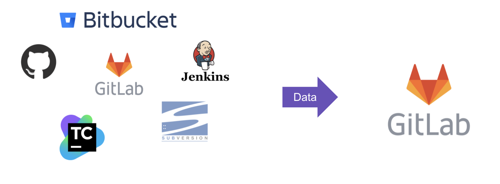

# Congregate

>>>
Requires [GitLab Premium](https://about.gitlab.com/pricing/) or above.

Released under the [GitLab EE license](LICENSE).

Customers are very welcome to trial and evaluate Congregate today. However it's recommended that you do independently review the features and functionality to ensure it meets your requirements while also being aware of any current [key limitations](/customer). For help troubleshooting or using Congregate, Customers need to enter into a paid engagement with GitLab Professional Services.

If you are planning to use Congregate to migrate to gitlab.com from a self-managed instance of GitLab, BitBucket (Server and Data Center), or GitHub Enterprise, you will need an admin token to conduct the migration due to some of the elevated APIs GitLab Professional Services uses during Service engagements.

>>>

Congregate is an automation wrapper around the [**GitLab APIs**](https://docs.gitlab.com/ee/api/api_resources.html#rest-api-resources), in particular the [group](https://docs.gitlab.com/ee/api/group_import_export.html) and [project](https://docs.gitlab.com/ee/api/project_import_export.html) export/import and [user](https://docs.gitlab.com/ee/api/users.html) APIs.

It is [**limited**](https://gitlab.com/gitlab-org/professional-services-automation/tools/migration/congregate/-/blob/master/customer/famq.md) by the functionality of those APIs. [**Here**](https://gitlab.com/gitlab-org/professional-services-automation/tools/migration/congregate/-/blob/master/customer/gitlab-migration-features-matrix.md) are ways in which congregate extends that functionality.

Congregate is a migration tool that can move data from many different Source Code Management (SCM) and Continuous Integration (CI) systems into a GitLab Self Managed (SM) instance hosted in the customer data center/cloud or GitLab.com. It is what GitLab Professional Services uses for large scale migration engagements. It is being shared in a [source-available](https://about.gitlab.com/solutions/open-source/) way, under the [GitLab EE license](https://en.wikipedia.org/wiki/Source-available_software#GitLab_Enterprise_Edition_License_(EE_License)), for collaboration with Customers and Partners.

Congregate gathers (meta)data from source system(s), transforms and down-selects it to prepare for migration, and migrates the data into the destination GitLab instance. Check out our [quick-start guide](./docs/using-congregate.md#quick-start) to get started with congregate today.

- [Contributing Guide](./docs/contributing.md)
- [Quick-start guide to using congregate](./docs/using-congregate.md#quick-start)
- [Using Congregate - Full test environment setup](./docs/full_setup.md)
- Data Elements supported by source system ([GitHub](./customer/github-migration-features-matrix.md), [BitBucket](./customer/bitbucket-migration-features-matrix.md), [GitLab](./customer/gitlab-migration-features-matrix.md))
- [Congregate Commands Help Page](./congregate/main.py#L5)
- [Congregate technical documentation](https://gitlab-org.gitlab.io/professional-services-automation/tools/migration/congregate/)
- [Setup Development Environment](./docs/setup-dev-env.md)
- [Frequently asked question about automated migrations](./customer/famq.md)
- [Technical Troubleshooting](./docs/troubleshooting.md)
- [Migration Service Delivery Kit](https://gitlab.com/gitlab-org/professional-services-automation/delivery-kits/migration-template)
- [GitLab Partner Program](https://partners.gitlab.com/English/?ReturnUrl=/prm/English/c/Training)

For support questions please [create an issue](https://gitlab.com/gitlab-org/professional-services-automation/tools/migration/congregate/-/issues/new?issuable_template=congregate-support)
from our Congregate support [issue template](./.gitlab/issue_templates/congregate-support.md).
