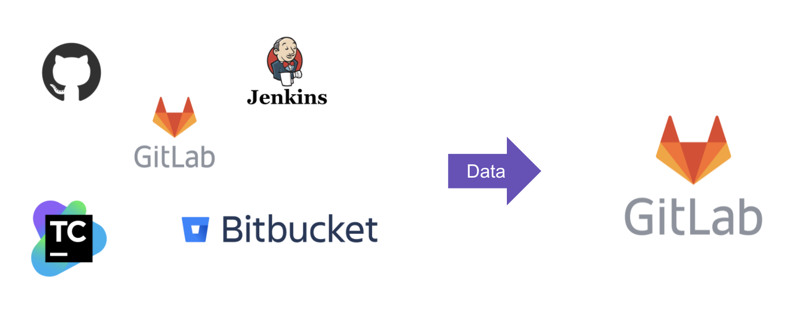

# Congregate

>>>
Requires [GitLab Premium](https://about.gitlab.com/pricing/) or above.

Released under the [GitLab EE license](LICENSE).
>>>

Congregate is a migration tool that can move data from many different Source Code Management (SCM) and Continuous Integration (CI) systems into a GitLab Self Managed (SM) instance hosted in the customer data center/cloud or GitLab.com. It is what GitLab Professional Services uses for large scale migration engagements. It is being shared in a [source-available](https://en.wikipedia.org/wiki/Source-available_software#GitLab_Enterprise_Edition_License_(EE_License)) way for collaboration with Customers and Partners.

Congregate gathers (meta)data from source system(s), transforms and down-selects it to prepare for migration, and migrates the data into the destination GitLab instance. Check out our [quick-start guide](./docs/using-congregate.md#quick-start) to get started with congregate today.

- [Contributing Guide](./docs/contributing.md)
- [Quick-start guide to using congregate](./docs/using-congregate.md#quick-start)
- [Using Congregate - Full test environment setup](./docs/full_setup.md)
- Data Elements supported by source system ([GitHub](./customer/github-migration-features.md), [BitBucket](./customer/bitbucket-migration-features.md), [GitLab](./customer/gitlab-migration-features.md))
- [Congregate Commands Help Page](./congregate/main.py#L5)
- [Congregate technical documentation](https://gitlab-org.gitlab.io/professional-services-automation/tools/migration/congregate/docs/)
- [Setup Development Environment](./docs/setup-dev-env.md)
- [Frequently asked question about automated migrations](./customer/famq.md)
- [Technical Troubleshooting](./docs/troubleshooting.md)
- [Migration Service Delivery Kit](https://gitlab.com/gitlab-org/professional-services-automation/delivery-kits/migration-template)

<!-->
## About

* Congregate is a Professional Services utility for migrating one or more data sources into a single GitLab instance.
* Users are migrated using individual API endpoints.
* Congregate leverages both the [Project](https://docs.gitlab.com/ee/api/project_import_export.html) and [Group](https://docs.gitlab.com/ee/api/group_import_export.html) Export / Import API to migrate projects and groups.
  * Export / Import on the source and destination instance are bound by [rate limit settings](https://docs.gitlab.com/ee/api/README.html#rate-limits).
  * [Other important notes](https://docs.gitlab.com/ee/user/project/settings/import_export.html#important-notes) for Project import/export
  * [Other important notes](https://docs.gitlab.com/ee/user/group/settings/import_export.html#important-notes) for Group import/export
  * Depending on the GL version [immediate project and group deletion permissions](https://about.gitlab.com/handbook/support/workflows/hard_delete_project.html) may vary.
* Missing project and group Export/Import features are migrated using individual API endpoints.
* You can read more about how Congregate contributes to our overall migration strategy on the [Importers direction page](https://about.gitlab.com/direction/manage/importers/#consuming-import-capabilities).
* Importer epics:
  * [Importer Portfolio Epic](https://gitlab.com/groups/gitlab-org/-/epics/2720)
  * [Importers Strategy](https://gitlab.com/groups/gitlab-org/-/epics/2721)
  * [GitLab Group Export/Import bugs](https://gitlab.com/groups/gitlab-org/-/epics/4614)
  * [GitLab Project Export/Import bugs](https://gitlab.com/groups/gitlab-org/-/epics/3054)
  * [Bitbucket Importer bugs](https://gitlab.com/groups/gitlab-org/-/epics/5514)
  * [GitHub Importer bugs](https://gitlab.com/groups/gitlab-org/-/epics/3050)
* Congregate will not be ported into the GitLab application as-is, but certain pieces of existing Congregate functionality will be rebuilt in GitLab, which remains focused on self-service migrations. To track this work, please visit the [GitLab Group Migration](https://gitlab.com/groups/gitlab-org/-/epics/2901) epic.
-->
