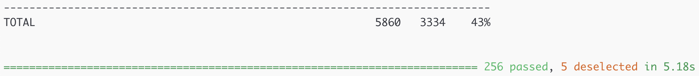

# Congregate

[[_TOC_]]

## About

* Congregate is a Professional Services utility for migrating one or more GitLab instances into another, single GitLab instance.
* Users are migrated using individual API endpoints.
* Congregate leverages both the [Project](https://docs.gitlab.com/ee/api/project_import_export.html) and [Group](https://docs.gitlab.com/ee/api/group_import_export.html) export / import API to migrate projects and groups.
* Missing project and group export / import features are migrated using individual API endpoints.
* Congregate will not be ported into the GitLab application as-is, but certain pieces of existing Congregate functionality will be rebuilt in GitLab. To track this work, please visit the [GitLab Group Migration](https://gitlab.com/groups/gitlab-org/-/epics/2901) epic.

```text
Come together, right now

...over me
```

## Dependencies

* Python 3.8
* [AWS CLI](https://aws.amazon.com/cli/)
* [Poetry](https://python-poetry.org/)
* [Node v11.13.0](https://www.npmjs.com/)

## Setup

### TL;DR Install

This document assumes you have a working python 3.8.5 or greater installed, you know how to clone a repo in terminal, and switch to its directory.  If you do not have a working python, you will need to take appropriate OS specific steps to install it.

After cloning [the repo](https://gitlab.com/gitlab-com/customer-success/tools/congregate/) and changing to the directory in terminal, run the following appropriate commands to run your first UT!

1. For Mac users, using `brew`:
   1. `brew update`
   2. Upgrade to `python@3.8`: `brew upgrade python@3.8`
   3. Restart terminal or open separate tab (shell)
   4. `pip3 install poetry`
   5. `pip3 -V` (e.g. `pip 20.1.1 from /usr/local/lib/python3.8/site-packages/pip (python 3.8)`)
   6. `poetry -V` (e.g. `Poetry version 1.0.9`)
   7. `python -V` Currently congregate only works in Python 3. Your python needs to be `Python 3.8.5` or greater.
   8. In case of multiple poetry virtualenvs (`<HOME>/Library/Caches/pypoetry/virtualenvs/`), perform the following steps to set Python 3 as the active one:
      1. Set your Python to point (via `~/.bashrc` alias or symlink) to Python 3
      2. Run `poetry env use python3.8` (`python2.7` when reverting back to Python 2)
      3. Run `poetry install -v` (resolves the `pyproject.toml` dependencies, and installs the versions specified in the `poetry.lock` file)

      **NOTE:** By removing the `poetry.lock` file or running `poetry update` you are deviating from the default set versions of the dependencies. When in doubt add `--no-dev` (Do not install dev dependencies) and `--dry-run` (`poetry update` only) to avoid dev dependencies i.e. inspect new versions before updating to them.
2. Install the python poetry virtual environment manager: `pip install poetry` If pip install poetry doesn't work: \
 `curl -sSL https://raw.githubusercontent.com/python-poetry/poetry/master/get-poetry.py | python`
1. Source the poetry environment: `source $HOME/.poetry/env`
1. Verify poetry works: `poetry --version`. If this doesn't work, add the following line to your appropriate rc file, usually `.zshrc`: \
`export PATH=$HOME/.poetry/bin:$PATH` and retry `poetry --version`
1. Install python dependencies `poetry install`
   1. To update dependencies run `poetry update`
1. Install NVM for Node Version Management \
 `curl -o- https://raw.githubusercontent.com/nvm-sh/nvm/v0.35.3/install.sh | bash`
1. If you are using zsh (mac default) copy this into `.zshrc`.  If not, copy into `.bashrc`.  Both of these files are generally found at `~/` \
`export NVM_DIR="$HOME/.nvm"` \
`[ -s "$NVM_DIR/nvm.sh" ] && \. "$NVM_DIR/nvm.sh"  # This loads nvm` \
`[ -s "$NVM_DIR/bash_completion" ] && \. "$NVM_DIR/bash_completion"  # This loads nvm bash_completion`
1. Source whatever filed you copied the lines into. i.e.; `source .zshrc`
1. Install nvm: `nvm install 11.13.0`
1. Use specific nvm version: `nvm use 11.13.0`
1. Install UI dependencies: `npm install`
1. Create congregate path: `CONGREGATE_PATH=$(pwd)`
1. Copy congregate script to a bin directory: `cp congregate.sh /usr/local/bin/congregate`
1. Initialize additional congregate directories \
`congregate init` \
`echo "export CONGREGATE_PATH=$CONGREGATE_PATH" >> ~/.bash_profile`

#### Congratulations

If we made it this far without errors, we are done with the basic install for development! The next command will run the UT and verify your installation is working.

```bash
poetry run pytest -m "not e2e and not e2e_setup and not e2e_setup_2" --cov-config=.coveragerc --cov=congregate congregate/tests/
```

Success looks like;


**NOTE:** Warnings should not be ignored, as they may cause the remote unit test job to fail. To easily discover and allow warnings comment out the following line in `congregate/tests/pytest.ini`:

```python
filterwarnings = error
```

## Configuring Congregate

Once all of the dependencies are installed, run `congregate configure` to set up the Congregate config.

### Config staging location

The only fully supported method for both group and project export / import is:

* **filesystem** - export, download and import data locally.

The following method is supported only for project export / import:

* **aws** - export and download data directly to an S3 bucket and import directly from the S3 bucket.
  * AWS (S3) user attributes are **not yet** available on the Group export / import API.

The following method may be supported in the future ([issue](https://gitlab.com/gitlab-com/customer-success/tools/congregate/issues/119)):

* **filesystem-aws** - export and download data locally, copy it to an S3 bucket for storage, then delete the data locally. Copy the data back from S3, import it and then delete the local data again.
  * This is used to help work with company policies like restricting presigned URLs or in case any of the source instances involved in the migration cannot connect to an S3 bucket while the destination instance can.

### Install & Use Poetry and Node (required for end-user and development setups)

```bash

# Install poetry with different OSs

# osx/Linux/bash on Windows Install Instructions
curl -sSL https://raw.githubusercontent.com/python-poetry/poetry/master/get-poetry.py | python

# windows powershell Install Instructions
Invoke-WebRequest -Uri https://raw.githubusercontent.com/python-poetry/poetry/master/get-poetry.py -UseBasicParsing).Content | python

# Install with pip
pip install poetry

# Install dependencies from Pipfile
cd <path_to_congregate>
poetry install

# Start-up python virtualenv
cd <path_to_congregate>
poetry shell

# Install NVM for managing node versions
curl -o- https://raw.githubusercontent.com/nvm-sh/nvm/v0.35.3/install.sh | bash
nvm install 12.18.4
nvm use 12.18.4

# Install ui dependencies
cd <path_to_congregate>
npm install
```

### Installing and configuring Congregate (end-user)

From **docker**:

1. Pull the docker image from the container registry
    * For official versioned releases, pull from registry.gitlab.com/gitlab-com/customer-success/tools/congregate
    * For rolling releases, pull from registry.gitlab.com/gitlab-com/customer-success/tools/congregate/master
2. Run the following command:

```bash
docker login registry.gitlab.com/gitlab-com/customer-success/tools/congregate -u <user name> -p <personal token>
docker run \
--name <name> \
-v /var/run/docker.sock:/var/run/docker.sock \ # expose docker socket as volume
-v <path_to_local_storage>:/opt/congregate/data \ # expose data directory as volume
-p 8000:8000 \ # expose UI port
-it registry.gitlab.com/gitlab-com/customer-success/tools/congregate:latest \
/bin/bash
./congregate.sh configure
./congregate.sh list
```

To resume the container:

```bash
docker start <container-id>
docker exec -it <container-id> /bin/bash
```

**N.B.** To bring up docker aliases and others run:

`. dev/bin/env`

From **tar.gz**:

1. Navigate to the project's *Repository -> Files* page
2. Download the latest tar.gz
3. Run the following commands:

```bash
tar -zxvf congregate-${version}.tar.gz
export CONGREGATE_PATH=<path_to_congregate>
cp congregate.sh /usr/local/bin
```

From **source**:

1. Clone this repo
2. Run the following commands:

```bash
cd <path_to_congregate>
export CONGREGATE_PATH=<path_to_congregate>
cp congregate.sh /usr/local/bin
```

#### Configuring

Before you start make sure to have a source and destination instance available and accessible from Congregate.

**N.B.** Congregate is currently only configurable to migrate from GitLab -> GitLab (either SaaS or self-managed).
Migrating from and to other external instances (BitBucket, GitHub, etc.) is currently not supported.

Using the `root` user account create a Personal Access Token or PAT (preferably create a separate user with Admin privileges) on both instances.
From the user profile's *Settings -> Access Tokens* enter a name and check `api` from *Scopes*. This may change once more granular rights are introduced for PATs as described [here](https://gitlab.com/groups/gitlab-org/-/epics/637).
Make sure to safely store the tokens before configuring.

As part of project migrations Congregate extends the Project export/import API by migrating registries (docker images).
Make sure to enable the **Container Registry** on both instances as you will need the hostnames during configuration.
Apart from the `/etc/gitlab/gitlab.rb` file you may lookup the hostname on an empty project's *Packages -> Container Registry* page.

Run the following commands to configure Congregate and retrieve info from the source instance:

```bash
./congregate.sh configure
./congregate.sh list
```

To enable Slack alerting (via [Incoming Webhooks](https://api.slack.com/messaging/webhooks)) configure the `slack_url`. This way the `ERROR` and `WARNING` logs will be also sent to a dedicated Slack channel.

All secrets (PATs, S3 keys) are obfuscated in your `congregate.conf` configuration file.

With Congregate configured and projects, groups, and users retrieved, you should be ready to use the tool or test your changes.

**N.B.** Instead of exporting an environment variable within your shell session, you can also add `CONGREGATE_PATH` to `bash_profile` or an `init.d` script. This is a bit more of a permanent solution than just exporting the variable within the session.

### Usage

``` text
Usage:
    congregate init
    congregate list
    congregate configure
    congregate stage-projects <projects>... [--skip-users] [--commit]
    congregate stage-groups <groups>... [--skip-users] [--commit]
    congregate migrate [--processes=<n>] [--skip-users] [--skip-group-export] [--skip-group-import] [--skip-project-export] [--skip-project-import] [--only-post-migration-info] [--commit]
    congregate rollback [--hard-delete] [--skip-users] [--skip-groups] [--skip-projects] [--commit]
    congregate ui
    congregate do-all [--commit]
    congregate do-all-users [--commit]
    congregate do-all-groups-and-projects [--commit]
    congregate search-for-staged-users
    congregate update-aws-creds
    congregate add-users-to-parent-group [--commit]
    congregate remove-blocked-users [--commit]
    congregate update-user-permissions [--access-level=<level>] [--commit]
    congregate get-total-count
    congregate find-unimported-projects [--commit] # TODO: Refactor, project name matching does not seem correct
    congregate stage-unimported-projects [--commit] # TODO: Refactor, broken
    congregate remove-users-from-parent-group [--commit]
    congregate migrate-variables-in-stage [--commit]
    congregate mirror-staged-projects [--commit]
    congregate remove-all-mirrors [--commit]
    congregate find-all-non-private-groups
    congregate make-all-internal-groups-private # TODO: Refactor or rename, as it does not make any changes
    congregate check-projects-visibility # TODO: Refactor or rename, as it's not a check but does an update. Add dry-run
    congregate set-default-branch [--commit]
    congregate enable-mirroring [--commit] # TODO: Find a use for it or remove
    congregate count-unarchived-projects
    congregate archive-staged-projects [--commit]
    congregate unarchive-staged-projects [--commit]
    congregate find-empty-repos
    congregate compare-groups [--staged]
    congregate staged-user-list
    congregate generate-seed-data [--commit] # TODO: Refactor, broken
    congregate validate-staged-groups-schema
    congregate validate-staged-projects-schema
    congregate map-users [--commit]
    congregate generate-diff [--processes=<n>] [--staged] [--rollback]
    congregate clean [--commit]
    congregate stitch-results [--result-type=<project|group|user>] [--no-of-files=<n>] [--head|--tail]
    congregate obfuscate
    congregate -h | --help

Options:
    -h, --help                              Show Usage.

Arguments:
    processes                               Set number of processes to run in parallel.
    commit                                  Disable the dry-run and perform the full migration with all reads/writes. 
    skip-users                              Stage: Skip staging users; Migrate: Skip migrating users; Rollback: Remove only groups and projects.
    hard-delete                             Remove user contributions and solely owned groups.
    skip-groups                             Rollback: Remove only users and projects.
    skip-group-export                       Skip exporting groups from source instance.
    skip-group-import                       Skip importing groups to destination instance.
    skip-projects                           Rollback: Remove only users and empty groups.
    skip-project-export                     Skips the project export and assumes that the project file is already ready
                                                for rewrite. Currently does NOT work for exports through filesystem-aws.
    skip-project-import                     Will do all steps up to import (export, re-write exported project json,
                                                etc). Useful for testing export contents. Will also skip any external source imports
    only-post-migration-info                Skips migrating all content except for post-migration information. Use when import is handled outside of congregate
    access-level                            Update parent group level user permissions (Guest/Reporter/Developer/Maintainer/Owner).
    staged                                  Compare using staged data
    no-of-files                             Number of files used to go back when stitching JSON results
    result-type                             For stitching result files. Options are project, group, or user
    head                                    Read results files in chronological order
    tail                                    Read results files in reverse chronological order (default for stitch-results)

Commands:
    list                                    List all projects of a source instance and save it to {CONGREGATE_PATH}/data/project_json.json.
    init                                    Creates additional directories and files required by congregate
    configure                               Configure congregate for migrating between two instances and save it to {CONGREGATE_PATH}/data/congregate.conf.
    stage-projects                          Stage projects to {CONGREGATE_PATH}/data/staged_projects.json,
                                                their parent groups to {CONGREGATE_PATH}/data/staged_groups.json.
                                                all project and group members to {CONGREGATE_PATH}/data/staged_users.json,
                                                All projects can be staged with '.' or 'all'.
                                                Individual ones can be staged as a space delimited list of integers (project IDs).
    stage-groups                            Stage groups and sub-groups to {CONGREGATE_PATH}/data/staged_groups.json,
                                                all their projects (except shared - with_shared=False) to {CONGREGATE_PATH}/data/staged_projects.json,
                                                all project and group members to {CONGREGATE_PATH}/data/staged_users.json,
                                                All groups can be staged with '.' or 'all'.
                                                Individual ones can be staged as a space delimited list of integers (group IDs).
    migrate                                 Commence migration based on configuration and staged assets.
    rollback                                Remove staged users/groups/projects on destination.
    ui                                      Deploy UI to port 8000.
    do-all*                                 Configure system, retrieve all projects, users, and groups, stage all information, and commence migration.
    search-for-staged-users                 Search for staged users on destination based on email
    update-aws-creds                        Run awscli commands based on the keys stored in the config. Useful for docker updates.
    add-users-to-parent-group               If a parent group is set, all staged users will be added to the parent group with guest permissions.
    remove-blocked-users                    Remove all blocked users from staged projects and groups.
    update-user-permissions                 Update parent group member access level. Mainly for lowering to Guest/Reporter.
    get-total-count                         Get total count of migrated projects. Used to compare exported projects to imported projects.
    find-unimported-projects                Return a list of projects that failed import.
    stage-unimported-projects               Stage unimported projects based on {CONGREGATE_PATH}/data/unimported_projects.txt.
    remove-users-from-parent-group          Remove all users with at most reporter access from the parent group.
    migrate-variables-in-stage              Migrate CI variables for staged projects.
    mirror-staged-projects                  Set up project mirroring for staged projects.
    remove-all-mirrors                      Remove all project mirrors for staged projects.
    find-all-non-private-groups             Return list of all groups on destination that are either internal or public.
    make-all-internal-groups-private        Make all internal migrated groups private.
    check-projects-visibility               Return list of all migrated projects' visibility.
    set-default-branch                      Set default branch to master for all projects on destination.
    enable-mirroring                        Start pull mirror process for all projects on destination.
    count-unarchived-projects               Return total number and list of all anarchived projects on source.
    find-empty-repos                        Inspect project repo sizes between source and destination instance in search for empty repos.
                                                This could be misleading as it sometimes shows 0 (zero) commits/tags/bytes for fully migrated projects.
    compare-groups                          Compare source and destination group results.
    staged-user-list                        Output a list of all staged users and their respective user IDs. Used to confirm IDs were updated correctly.
    archive-staged-projects                 Archive projects that are staged, not necessarily migrated.
    unarchive-staged-projects               Unarchive projects that are staged, not necessarily migrate.
    generate-seed-data                      Generate dummy data to test a migration.
    validate-staged-groups-schema           Check staged_groups.json for missing group data.
    validate-staged-projects-schema         Check staged_projects.json for missing project data.
    clean                                   Delete all retrieved and staged data
    stitch-results                          Stitches together migration results from multiple migration runs
    generate-diff                           Generates HTML files containing the diff results of the migration
    map-users                               Maps staged user emails to emails defined in the user-provided user_map.csv
    obfuscate                               Obfuscate a secret or password that you want to manually update in the config.
```

#### Important Notes

* The GitLab Project export / import API versions need to match between instances. [This documentation](https://docs.gitlab.com/ee/user/project/settings/import_export.html) shows which versions of the API exist in each version of GitLab.
* The GitLab Group export / import API versions need to match between instances and be at least on **12.8**.

#### Migration steps

##### Dry-run

For all API facing commands `dry_run` is the default mode.
To revert it add `--commit` at the end.

##### Migrate users

Best practice is to first migrate ONLY users by running:

* `congregate ui &` - Open the UI in your browser (by default `localhost:8000`), select and stage all users.
* `congregate migrate --skip-group-export --skip-group-import --skip-project-export --skip-project-import` - Inspect the dry-run output in:
  * `data/dry_run_user_migration.json`
  * `data/congregate.log`
  * Inspect `data/staged_users.json` if any of the NOT found users are blocked as, by default, they will not be migrated.
  * To explicitly remove blocked users from staged users, groups and projects run `congregate remove-blocked-users`.
* `congregate migrate --skip-group-export --skip-group-import --skip-project-export --skip-project-import --commit`

##### Migrate groups and sub-groups

Once all the users are migrated:

* Go back to the UI, select and stage all groups and sub-groups
* Only the top level groups will be staged as they comprise the entire tree structure.
* `congregate search-for-staged-users` - Check output for found and NOT found users on destination.
  * All users should be found.
  * Inspect `data/staged_users.json` if any of the NOT found users are blocked as, by default, they will not be migrated.
  * To explicitly remove blocked users from staged users, groups and projects run `congregate remove-blocked-users`.
* `congregate migrate --skip-users --skip-project-export --skip-project-import` - Inspect the dry-run output in:
  * `data/dry_run_group_migration.json`
  * `data/congregate.log`
* `congregate migrate --skip-users --skip-project-export --skip-project-import --commit`

##### Migrate projects

Once all the users and groups (w/ sub-groups) are migrated:

* Go back to the UI, select and stage projects (either all, or in waves).
* `congregate search-for-staged-users` - Check output for found and NOT found users on destination.
  * All users should be found.
  * Inspect `data/staged_users.json` if any of the NOT found users are blocked as, by default, they will not be migrated.
  * To explicitly remove blocked users from staged users, groups and projects run `congregate remove-blocked-users`.
* `congregate migrate --skip-users --skip-group-export --skip-group-import` - Inspect the dry-run output in:
  * `data/dry_run_project_migration.json`
  * `data/congregate.log`
* `congregate migrate --skip-users --skip-group-export --skip-group-import --commit`

##### Rollback

To remove all of the staged users, groups (w/ sub-groups) and projects on destination run:

* `congregate rollback` - Inspect the output in:
  * `data/congregate.log`
* `congregate rollback --commit`
* For more granular rollback see [Usage](#usage).

##### do-all commands

For a CLI only based migration, the following commands are available:

* `do-all` - Migrate all users, projects and their groups
* `do-all-users` - Migrate all users
* `do-all-groups-and-projects` - Migrate all projects and their groups

**N.B.** By default these commands will run in `dry_run` mode. To revert it add `--commit` at the end.

### Development Environment Setup

#### Live reloading for UI development and backend development without a debugger

You will need to turn on debugging in the flask app to see a mostly live reload of the UI. Create the following environment variable before deploying the UI

```bash
export FLASK_DEBUG=1
```

For the UI, you will still need to save the file in your editor and refresh the page, but it's better than restarting flask every time. The app will live reload every time a .py file is changed and saved.

#### Configuring VS Code for Debugging

Refer to [this how-to](https://code.visualstudio.com/docs/python/debugging) for setting up the base debugging settings for a python app in VS Code. Then replace the default `launch.json` flask configuration for this:

```json

{
    "name": "Python: Flask (0.11.x or later)",
    "type": "python",
    "request": "launch",
    "module": "flask",
    "env": {
        "PYTHONPATH": "${workspaceRoot}",
        "CONGREGATE_PATH": "<path_to_congregate>",
        "FLASK_APP": "${CONGREGATE_PATH}/ui"
    },
    "args": [
        "run",
        "--no-debugger",
        "--no-reload"
    ]
}

```

To reload the app in debugging mode, you will need to click the `refresh` icon in VS code (on the sidebar's Explorer tab). Currently VS code doesn't support live reloading flask apps on save.

#### If VS Code doesn't pick up poetry virtualenv

Find virtualenv path

```bash
poetry config --list
```

Add the following line to .vscode/settings.json:

```text
"python.venvPath": "/path/to/virtualenv"
```

You may need to refresh VS Code. VS Code will also call this python interpreter PipEnv, but if you check out the virtualenv directory poetry has stored, you can compare the virtualenv folder names to double check.

#### Debugging through the terminal (Python's byebug)

You can import `pdb` into the class you want to debug through a terminal and add `pdb.set_trace()` around the lines you would like to debug.
You can read more about using pdb [here](https://fuzzyblog.io/blog/python/2019/09/24/the-python-equivalent-of-byebug-is-pdb-set-trace.html)

#### Setting up bitbucket server for development

Refer to [this README](docker/bitbucket/README.md) for details on setting up a BitBucket server for local development

#### Issues with installing node dependencies

You can delete the `node_modules` folder and re-run `npm install` if you are experiencing issues with frontend dependencies. 
If you are still having issues with getting the UI to build correctly after re-installing the dependencies and you don't have any linting issues,
reach out to a maintainer or create an issue pinging @leopardm or @pprokic

## Migration features

:white_check_mark: = supported

:heavy_minus_sign: = not yet supported / in development

:x: = not supported

| Main           | Feature                                | Sub-feature                                                                                                                                                       | GitLab             | Congregate         |
| -------------- | -------------------------------------- | ----------------------------------------------------------------------------------------------------------------------------------------------------------------- | ------------------ | ------------------ |
| **Group**      |
|                | Milestones                             |                                                                                                                                                                   | :white_check_mark: | :white_check_mark: |
|                | Badges                                 |                                                                                                                                                                   | :white_check_mark: | :white_check_mark: |
|                | Labels                                 |                                                                                                                                                                   | :white_check_mark: | :white_check_mark: |
|                | Boards                                 | Board Assignee, Labels, Lists                                                                                                                                     | :white_check_mark: | :white_check_mark: |
|                | Members                                |                                                                                                                                                                   | :white_check_mark: | :white_check_mark: |
|                | Epics                                  | Parent, Award Emoji, Events, Notes                                                                                                                                | :white_check_mark: | :white_check_mark: |
|                | CI variables                           |                                                                                                                                                                   | :x:                | :white_check_mark: |
|                | Hooks                                  |                                                                                                                                                                   | :x:                | :white_check_mark: |
|                | Deploy Tokens                          |                                                                                                                                                                   | :x:                | :heavy_minus_sign: |
|                | Audit Events                           |                                                                                                                                                                   | :x:                | :x:                |
|                | Avatars                                |                                                                                                                                                                   | :x:                | :x:                |
| **Project**    |
|                | Labels                                 |                                                                                                                                                                   | :white_check_mark: | :white_check_mark: |
|                | Milestones                             | Events                                                                                                                                                            | :white_check_mark: | :white_check_mark: |
|                | Issues                                 | Events, Timelogs, Notes, Label Links, Milestone, Resource Label Events, Issue Assignees, Zoom Meetings, Sentry Issue, Award Emoji, Designs, Design Versions, Epic | :white_check_mark: | :white_check_mark: |
|                | Snippets                               | Notes, Award Emoji                                                                                                                                                | :white_check_mark: | :white_check_mark: |
|                | Releases                               |                                                                                                                                                                   | :white_check_mark: | :white_check_mark: |
|                | Members                                |                                                                                                                                                                   | :white_check_mark: | :white_check_mark: |
|                | Group Members                          |                                                                                                                                                                   | :white_check_mark: | :white_check_mark: |
|                | Merge requests                         | Metrics, Award Emoji, Notes, Merge Request Diff, Events, Timelogs, Label Links, Milestone, Resource Label Events                                                  | :white_check_mark: | :white_check_mark: |
|                | CI Pipelines                           | Notes, Stages, External Pull Requests, Merge Request                                                                                                              | :white_check_mark: | :white_check_mark: |
|                | Pipeline schedules (without variables) |                                                                                                                                                                   | :white_check_mark: | :white_check_mark: |
|                | External Pull Requests                 |                                                                                                                                                                   | :white_check_mark: | :white_check_mark: |
|                | Auto DevOps                            |                                                                                                                                                                   | :white_check_mark: | :white_check_mark: |
|                | Triggers                               |                                                                                                                                                                   | :white_check_mark: | :white_check_mark: |
|                | Services                               |                                                                                                                                                                   | :white_check_mark: | :white_check_mark: |
|                | Protected Branches                     | Merge Access Levels, Push Access Levels, Unprotect Access Levels                                                                                                  | :white_check_mark: | :white_check_mark: |
|                | Branches                               |                                                                                                                                                                   | :white_check_mark: | :white_check_mark: |
|                | Default Branch                         |                                                                                                                                                                   | :white_check_mark: | :white_check_mark: |
|                | Protected Environments                 | Deploy Access Levels                                                                                                                                              | :white_check_mark: | :white_check_mark: |
|                | Protected Tags                         | Create Access Levels                                                                                                                                              | :white_check_mark: | :white_check_mark: |
|                | Project Feature                        |                                                                                                                                                                   | :white_check_mark: | :white_check_mark: |
|                | Custom Attributes                      |                                                                                                                                                                   | :white_check_mark: | :white_check_mark: |
|                | Badges                                 |                                                                                                                                                                   | :white_check_mark: | :white_check_mark: |
|                | CI/CD Settings                         |                                                                                                                                                                   | :white_check_mark: | :white_check_mark: |
|                | Error Tracking Setting                 |                                                                                                                                                                   | :white_check_mark: | :white_check_mark: |
|                | Metrics Setting                        |                                                                                                                                                                   | :white_check_mark: | :white_check_mark: |
|                | Boards                                 | Lists                                                                                                                                                             | :white_check_mark: | :white_check_mark: |
|                | Service Desk Setting                   |                                                                                                                                                                   | :white_check_mark: | :white_check_mark: |
|                | CI variables                           |                                                                                                                                                                   | :x:                | :white_check_mark: |
|                | Avatars                                |                                                                                                                                                                   | :white_check_mark: | :white_check_mark: |
|                | Uploads                                |                                                                                                                                                                   | :white_check_mark: | :white_check_mark: |
|                | LFS Objects                            |                                                                                                                                                                   | :white_check_mark: | :white_check_mark: |
|                | Wikis                                  |                                                                                                                                                                   | :white_check_mark: | :white_check_mark: |
|                | Push rules                             |                                                                                                                                                                   | :x:                | :white_check_mark: |
|                | Merge request approvals                |                                                                                                                                                                   | :x:                | :white_check_mark: |
|                | Shared Groups                          |                                                                                                                                                                   | :x:                | :white_check_mark: |
|                | Registry Repositories                  |                                                                                                                                                                   | :x:                | :white_check_mark: |
|                | Container Expiration Policy            |                                                                                                                                                                   | :white_check_mark: | :white_check_mark: |
|                | Deploy keys                            |                                                                                                                                                                   | :x:                | :white_check_mark: |
|                | Awards                                 |                                                                                                                                                                   | :white_check_mark: | :white_check_mark: |
|                | Webhooks (w/o token)                   |                                                                                                                                                                   | :x:                | :white_check_mark: |
|                | Environments                           |                                                                                                                                                                   | :x:                | :white_check_mark: |
|                | Build Artifacts                        |                                                                                                                                                                   | :x:                | :x:                |
|                | Audit Events                           |                                                                                                                                                                   | :x:                | :x:                |
|                | Deploy tokens                          |                                                                                                                                                                   | :x:                | :heavy_minus_sign: |
|                | Remote mirrors                         |                                                                                                                                                                   | :x:                | :heavy_minus_sign: |
|                | Feature Flags                          |                                                                                                                                                                   | :x:                | :heavy_minus_sign: |
| **User**       |
|                | Avatars                                |                                                                                                                                                                   | :x:                | :white_check_mark: |
|                | Profile (API)                          |                                                                                                                                                                   | :x:                | :white_check_mark: |
|                | Preferences (API)                      |                                                                                                                                                                   | :x:                | :white_check_mark: |
|                | SSH keys                               |                                                                                                                                                                   | :x:                | :white_check_mark: |
|                | GPG keys                               |                                                                                                                                                                   | :x:                | :white_check_mark: |
|                | Secondary emails                       |                                                                                                                                                                   | :x:                | :heavy_minus_sign: |
|                | Account settings                       |                                                                                                                                                                   | :x:                | :x:                |
|                | Applications                           |                                                                                                                                                                   | :x:                | :x:                |
|                | Access Tokens                          |                                                                                                                                                                   | :x:                | :x:                |
|                | Active Sessions                        |                                                                                                                                                                   | :x:                | :x:                |
| **Standalone** |
|                | Version                                |                                                                                                                                                                   | :x:                | :white_check_mark: |
|                | System hooks (w/o token)               |                                                                                                                                                                   | :x:                | :white_check_mark: |
|                | Features                               |                                                                                                                                                                   | :x:                | :heavy_minus_sign: |
|                | Services                               |                                                                                                                                                                   | :x:                | :x:                |
|                | Deploy keys                            |                                                                                                                                                                   | :x:                | :x:                |
|                | ToDos                                  |                                                                                                                                                                   | :x:                | :x:                |
|                | Snippets                               |                                                                                                                                                                   | :x:                | :x:                |
|                | Runners                                |                                                                                                                                                                   | :x:                | :x:                |
