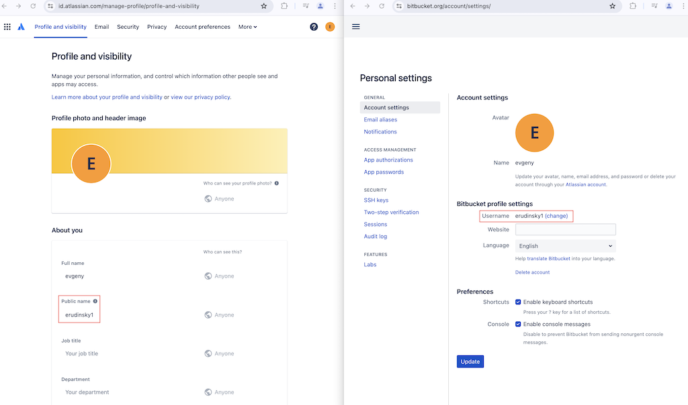
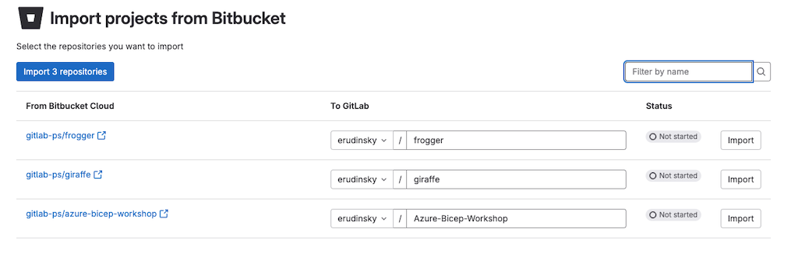
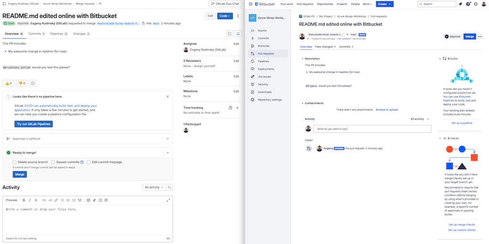

# BitBucket Cloud migration doc

Bitbucket Cloud importer works only with `bitbucket.org`. For BitBucket Server migration please refer to [this guide](./bitbucket-migration-features-matrix.md).

What can be migrated is described [here](https://docs.gitlab.com/ee/user/project/import/bitbucket.html). In addition for PR we have recently implemented [Merged / Closed by](https://gitlab.com/gitlab-org/gitlab-foss/-/issues/967) and [Reviewers](https://gitlab.com/gitlab-org/gitlab/-/issues/417578).

## Terminology

| Bitbucket Cloud | GitLab        | Comment                                                                                                                                                                     |
| --------------- | ------------- | --------------------------------------------------------------------------------------------------------------------------------------------------------------------------- |
| Pull Request    | Merge Request | Built in functionality allows to migrate pull requests from BBC. In GitLab pull request is called [merge request](https://docs.gitlab.com/ee/user/project/merge_requests/). |

GitLab has built in functionality to migrate from Bitbucket Cloud to GitLab. Follow [the doc](https://docs.gitlab.com/ee/user/project/import/bitbucket.html).

## Source code

Source code is migrated using importer preserving branches and tags. We use `--mirror` to migrate source to ensure all refs are copied as-is. See [more details](https://git-scm.com/docs/git-clone) on this.

## Requirements for user-mapped contributions

Be aware of the following: all users that are part bitbucket projects with contributions must be created beforehand and the below prerequisites have to be in place. Otherwise if the user is not found on GitLab.com or the below prerequisites are not in place any contribution will be mapped to the user that is doing import! If the user does not exist or the below prerequisites are not in place the PR gets migrated and assigned to the person doing the import. If contributions in comments are found and the user is not found or the below prerequisites are not in place the comments gets headed *Created by Username* (where Username is the nickname from Bitbucket).

Make sure to provision users. For gitlab.com using SAML just-in-time provisioning or via SCIM and IdP. Otherwise migrate them using Congregate.

In order to map user contributions it is important to set the following prerequisites:

- Verify that the username in the Bitbucket account settings matches the public name in the Atlassian account settings. If they don’t match, modify the public name in the Atlassian account settings to match the username in the Bitbucket account settings (see image below).
- Connect your Bitbucket account in [GitLab profile service sign-in](https://gitlab.com/-/profile/account).
- [Set your public email](https://docs.gitlab.com/ee/user/profile/index.html#set-your-public-email).

The actual import is performed from user interface of GitLab.Com via creation of new project and picking "Import Project > Bitbucket Cloud" option, as [explained here](https://docs.gitlab.com/ee/user/project/import/bitbucket.html#import-your-bitbucket-repositories). It is important to know that in the situation of a missing user (or incorrectly setup prerequisites as explained above) user contributions will be mapped to the user that performs migration. Tip here: create (via IDP) "special system user" that will be used to perform BBC migration, so the orphaned contributions will be mapped to that user instead. See below:

All that *the user importing repositories is entitled to see* will be shown (see above) and can be imported individually or all together

## User contribution mappings "caveats"

- If user mapping fails despite matching names refere to [troubleshooting guide](https://docs.gitlab.com/ee/user/project/import/bitbucket.html#user-mapping-fails-despite-matching-names).
- Username (BBC Nickname) is migrated and converted in comments into `plain text` (see more details in [this note](https://gitlab.com/gitlab-org/gitlab/-/issues/436307#note_1784021686)). See example below.

