# Jenkins Configuration

## Jenkins Server Preparations

1. See this [project](https://gitlab.com/gitlab-org/professional-services-automation/delivery-kits/jenkins-integration)
1. Ensure Jenkins Global Build Discarder is installed and max number of builds is set reasonably. Suggest 25.
    1. If there is too much data, the plugin updates will take hours or days as some plugins have to look at and/or modify every build
1. There are 3 Gitlab plugins that need to be installed.
    1. GitLab plugin
    1. GitLab API plugin
    1. GitLab Branch Source plugin
1. Download latest [Plugin Installation Manager Tool](https://github.com/jenkinsci/plugin-installation-manager-tool)
1. Use the plugin manager tool with `--no-download`, `--latest false`, and `--verbose` options
    1. Using your Jenkins version, check GitLab plugins, 1 by 1, to get supported Jenkins version
      1. Example command: 
      ```bash
      sudo java -jar jenkins-plugin-manager-2.11.1.jar --war jenkins.war --plugins gitlab-plugin:1.5.26 --no-download --latest false --verbose
      ```
      1. Check output and downgrade plugin version until Jenkins version is supported
1. Use the plugin manager tool with `--latest false` option to download all dependencies
    1. Example command: 
    ```bash
    sudo java -jar jenkins-plugin-manager-2.11.1.jar --war jenkins.war --plugins gitlab-plugin:1.5.26 gitlab-api:1.0.6 gitlab-branch-source:1.5.9 --latest false --list
    ```
1. Move downloaded files to Jenkins directory (default is /var/lib/jenkins/plugins)
1. Restart Jenkins
1. Verify plugins installed properly
1. Set up plugins per documentation for plugin version

## Connecting GitLab project to Jenkins Job

### Multi-branch Pipelines Jobs

By changing any configuration to a multi-branch pipeline, the scan will be triggered and builds will commence. If this is not acceptable, please do not change your configuration until you want the pipelines to run.

1. In the Jenkins UI (https://jenkins.example.com/), navigate to the job for the multi-branch pipeline.
1. Click Configure 
1. Under the Branch Sources section you will see the current source that is your current repository. We will create another source using the GitLab Project and then remove the current reference. Note the data in the `Credentials` and `Behaviors` sections as we will use them for the next steps
1. Click `Add source` and select and select `GitLab Project` 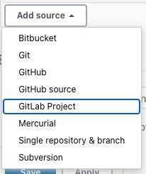
1. `Server` will default to `gitlab`
1. `Checkout Credentials` - Select the same credentials selected for the connection to your current repository. During migration, the deploy keys (public key) will be migrated to your GitLab project **IS THIS TRUE FOR ALL MIGRATION TYPES?**
1. `Owner` - Enter the path to the group where your project is located.
    1. Example: If your project is located at https://gitlab.com/company/example-group/example-subgroup/project-name the `Owner` field would be `company/example-group/example-subgroup` 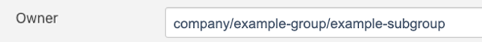
1. `Projects` - This list is dynamic and will populate based on the credentials and the owner fields. Select the GitLab project you want to associate to this Jenkins multi-branch pipeline job.
1. `Behaviours` - By default there are 3 behaviors.
    1. Discover branches - Discovers branches on the repository. Click the  on the far right of the `Strategy` section for more information.
    1. Discover merge requests from origin - Discovers merge requests where the origin project is the same as the target project. Click the  on the far right of the `Strategy` section for more information.
    1. Discover merge requests from forks - Discovers merge requests where the origin project is a fork of the target project. If you do not want to run pipelines for forked projects, remove by clicking the . Click the  on the far right of the `Strategy` or `Trust` section for more information.
    1. If you need to add other behaviors, click the `Add` button and select the behavior needed 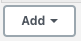
1. Compare the `Property strategy` from the Git Branch Source and replicate for the GitLab Project Branch Source 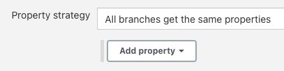
1. Remove the Git Branch Source by clicking the  on the right side 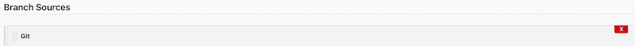
1. **Before this step, please review warning above**. Click `Save` or `Apply` to save the new configuration. `Save` will exit to the Jenkins job status page. `Apply` will store the configuration and leave you on the same page.
    1. A webhook will be created in your GitLab project with the proper settings and secrets to allow the webhook to trigger builds in Jenkins when changes are made.
    1. Indexing will start so the GitLab plugin can discover branches.
    1. The name of the Jenkins Multi-branch Pipeline job will change to the location of your repository in GitLab and the GitLab logo will show. The URL to your Jenkins job will not change.
1. You can test the changes by pushing a mock change to your repository or by creating a new branch.

### Pipeline Jobs

The configuration will require that the user has `Maintainer` or `Owner` role for the GitLab project associated.

There are 2 different ways to configure the Pipeline Jobs, through the Jenkins UI and Jenkins Pipeline scripts. You will need to determine if you are configuring your job via the UI or JenkinsFile. A key indicator is to look a section named triggers.

#### Configuration through the Jenkins UI

1. In the Jenkins UI (https://jenkins.example.com/), navigate to the job for the pipeline.
1. Click Configure 
1. Under the `Source Code Management` section you will see the current source that is your current repository 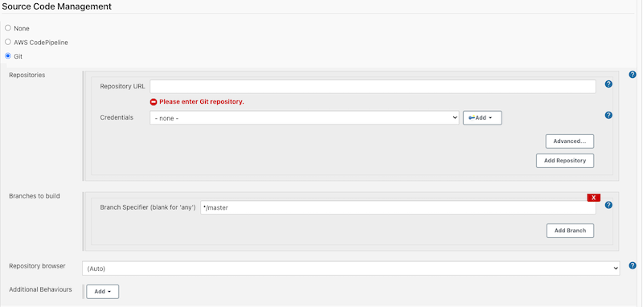

    1. Replace this with the git repo for your GitLab project. You can get this by navigating to your project in Gitlab, click `Clone` and then click the clipboard button to copy the path. The same credentials will work. During migration, the deploy keys (public key) were copied from your current repository to your new GitLab project <br/> 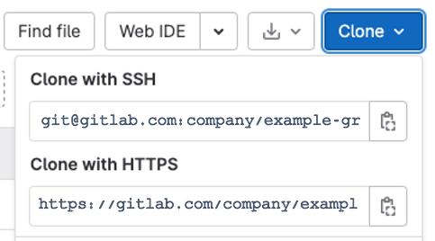

1. Under the `Build Triggers` section, select `Build when a change is pushed to GitLab`. Note the webhook URL as we will use it later in the configuration in the GitLab project 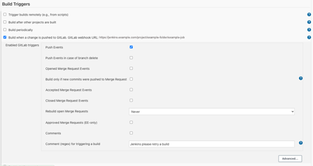
1. Here you can select the triggers for your project.
1. Click `Advanced...` in the bottom right. You can set more options for how the plugin operates, such as branch filtering.
    1. If you want to filter what branches are allowed to trigger the job, you have to do it when you set up the webhook in step 13. The Jenkins Plugin does not allow this for the version being used. This is the error you will see 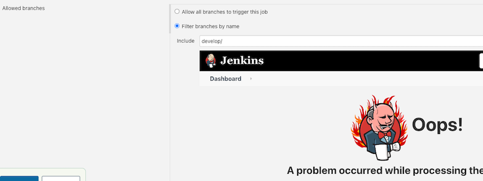
    1. This is what you should leave it as 
1. Scroll down to `Secret token` and click the `Generate` button. This will generate the token needed to trigger your pipeline when changes are made in your GitLab repository 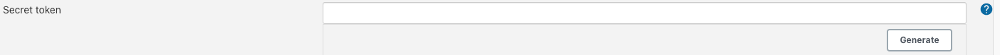
1. Copy the token. We will use it to create the webhook in your GitLab project.
1. Navigate to your project in GitLab.
    1. The next steps require the user to have a Maintainer or Owner role for the GitLab project
1. On the left side bar, at the bottom, hover over `Settings` and click on `Webhooks` 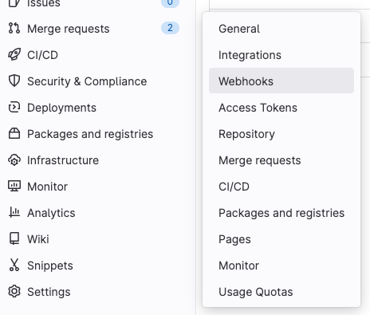
1. In the `URL` text box, you will use the webhook URL noted in your Jenkins job
1. In the `Secret` token text box, enter the Secret token you copied for your Jenkins job
1. Under the `Trigger` section, select the triggers you would like to use to trigger the Jenkins Job
1. Click the `Add webhook` button 
1. Save your project in Jenkins.
1. You can now test the job with an event from your `Trigger` list. 

#### Configuration through Pipeline Scripts

1. In your Jenkinsfile, identify the section for that annotates how your job is being triggered
1. Follow the [documentation](https://github.com/jenkinsci/gitlab-plugin/tree/gitlab-plugin-1.5.19) for the GitLab plugin version you are using
1. For the secret token, create a new credential in Jenkins that is the type `Secret Text`
1. Use the token id to call the credentials in the Jenkinsfile in the section `secretToken: project_token`
1. Add the webhook to your project in GitLab with the token data you created in step 3