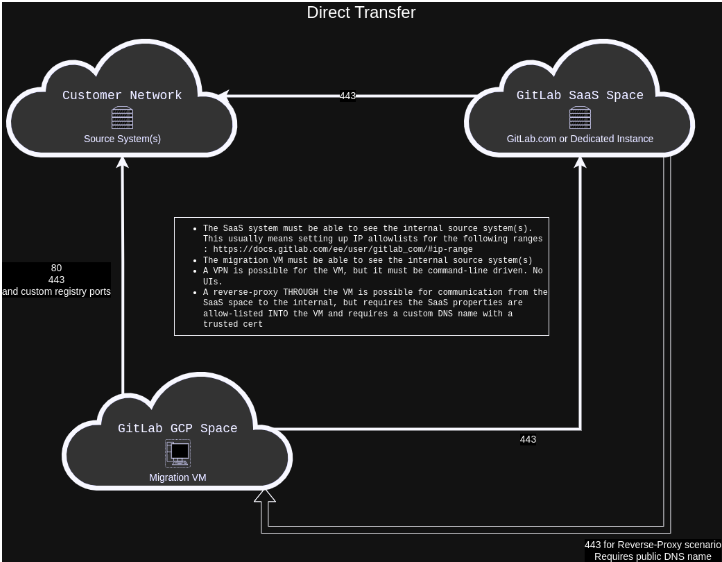
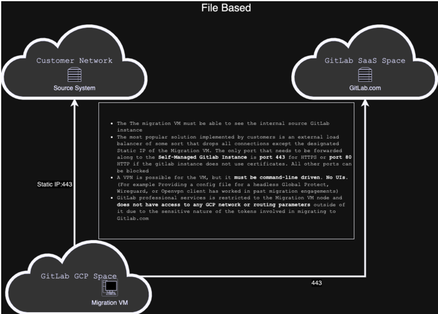

# Migration VMs

## Machines
The migration VMs are GCP compute instances (size variable depending on need) configured to use the latest version of the Ubuntu LTS family as their base OS. Currently, updates are handled manually by the individual engineer owners of each VM as part of their engagement preparation. Docker is installed on the machines as a requirement and additional shell tools or extensions (zsh, oh-my-zsh, etc) may be installed as a matter of preference.

### Why GCP VMs
There are several reasons we host our migration VMs in a dedicated GCP Project

- Token Security
  - Migrations require owner or admin-level tokens depending on the type of migration being performed. Admin tokens are not allowed outside GitLab-owned properties, limiting our options for VM location.
  - Owner tokens, while not carrying as large a scope, still benefit from the isolation
- Data and Network Security
  - This GCP network and project are monitored for intrusions and activity.
  - Avoiding the use of individual laptops increases the physical security
  - Modifications to the GCP project or to individual machines or their firewalls outside of this pipeline triggers a security alert
- Control
  - Machines can be locked behind GitLab-controlled firewalls, SSH keys, and IP restrictions
- Change Management and Traceability
  - Modifications to machine configurations are handled through SIRT and/or manager-approved merge requests and GitLab runner pipelines.

## Network

### VM Specifics

The VM has a dynamic external IP by default, but can be configured for static IPV4 if requested. It is secured by multiple firewall rules:

- An IP allowlist on TCP ports 22, 5555, and 8000 default configured for the engineers home IP
- An explicit deny for all other VMs hosted in the same GCP network space
- An IP allowlist for ICMP for all IPs
- Allowlist on 443 from fleet or engineer IPs as required depending on migration type (see below)

Further, SSH access is controlled via the aforementioned IP allowlist and single-use SSH RSA256 or ED25519 keys deployed to the authorized_hosts during instantiation.  The VM is considered transitory and reviewed for need every 30 days.  The VM is destroyed if no longer needed.

## Change Management

Change management for the migration VM is tracked through internal GitLab infrastructure issues and merge requests to our IaC system that require SIRT and/or management review before creation.

## Monitoring

Our GCP space has cloud monitoring in place which alerts our SIRT personnel if there are unapproved changes made to the GCP space or resources within that space. The monitoring stream is fed into our SIEM system for history and review.

Our monitoring is configured through wiz.io. The integration and monitoring:
- Grabs clones/snapshots of GCP data for vulnerability scanning purposes
- Utilizes compliance framework modules and CIS benchmark dashboards
- Enables 
  - Agentless Malware Scanning
  - Agentless Software Bill of Materials (SBOM)
  - Agentless File Integrity Monitoring
- We can also detect threats and abuse from Cloud Provider's audit logs and monitoring

## Migration Method Specific Network Requirements

Depending on the type of migration there are differing requirements for network connectivity

### Direct Transfer

The key piece to understand about Direct Transfer migrations is that they require connectivity FROM the destination system TO the source system as well as access for the VM to BOTH systems. This is different from the old file-based method, and more inline with our BitBucket and GitHub importers. Example below:

Customers who do not already have a publicly-available instance endpoint may be hesitant to open their firewall to the entire GitLab API fleet. To accommodate this, it is possible to configure a reverse-proxy on the migration VM. This has the following requirements:

- A domain name for the front-side (GitLab-exposed) of the VM
- A non-self-signed certificate for that domain to enable HTTPS
  - Direct Transfer currently requires HTTPS

### File-Based (deprecated)

With file-based migrations, the VM must be able to see the source and destination systems. No requirements exist for the source and destination system to be able to see each other.

This alleviates the need for opening the customer firewall to a potentially large address range. It is also our fallback for air-gapped migrations

### Other Networking Notes

#### VPN

Customers may require the use of a VPN client to connect from the VM to their instance. As stated, the migration VMs are headless Ubuntu servers. As such, VPN connectivity must enable:

- CLI-based connectivity for Ubuntu boxes
- Access to "remote users" through the VPN

Site-to-site VPNs or other dedicated gateways for connectivity between the customer network and the VM network OR GitLab properties are NOT available.
