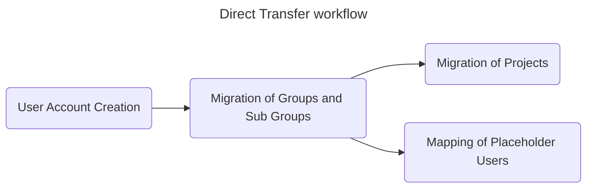

[TOC]

# Migrations using Direct Transfer via Congregate

Direct Transfer is the new standard for importing GitLab data into another GitLab instance.

Direct Transfer is available either [via the UI in Gitlab](https://docs.gitlab.com/ee/user/group/import/direct_transfer_migrations.html#connect-the-source-gitlab-instance) or by using the [Direct Transfer APIs](https://docs.gitlab.com/ee/api/bulk_imports.html).

Congregate can utilize Direct Transfer APIs to handle a large portion of the import process. Once groups and projects have been imported to GitLab via Direct Transfer, Congregate will run its own post-migration tasks to import additional components of a GitLab project or group that is excluded from Direct Transfer.

Key items which Congregate migrates post Direct Transfer migrations are (amongst others):

- CI/CD variables (both group and project level)
- Container registries
- Package registries

Refer to the [features matrix](https://gitlab.com/gitlab-org/professional-services-automation/tools/migration/congregate/-/blob/fabiankoh/direct-transfer-create-docs/customer/gitlab-migration-features-matrix.md) for a detailed list of items which are migrated by Direct Transfer, and ones that are migrated by Congregate post the Direct Transfer migration.

In general, migrations using Direct Transfer via Congregate involve interaction with the following interfaces:

- The migration VM and Congregate container(s) - for configuration preparation, viewing logs, troubleshooting
- The Congregate UI - to [trigger migration activities](https://gitlab.com/gitlab-org/professional-services-automation/tools/migration/congregate/-/blob/master/docs/direct-transfer-usage.md)
- The GitLab Direct Transfer UI - `<destination-hostname>/import/bulk_imports/history` - to track progress of Direct Transfer imports
  - **NOTE:** Only accessible to the import user

## Setting up the Congregate environment to use Direct Transfer

Refer to [this page](https://gitlab.com/gitlab-org/professional-services-automation/tools/migration/congregate/-/blob/master/runbooks/setting-up-direct-transfer-migrations.md) for details on setting up Congregate to use Direct Transfer.

## Direct Transfer workflow

The general workflow of Direct Transfer migrations align to the following steps:

1. User account creation and preparation
2. Migration of groups and sub groups
3. Migration of projects
4. Mapping of Placeholder users (from source) to users (on destination) ^

**NOTE:** With direct-transfer and placeholder user mapping, all steps can happen in parallel, as part of a single migration wave. However, we strongly advise running them sequentially.

### Placeholder Users

#### Introduction

[Placeholder users](https://docs.gitlab.com/ee/user/project/import/index.html#placeholder-users) were introduced in version 17.4 and is now enabled by default on Gitlab.com, and by default on self-managed versions running 17.7 and higher.

The concept of [Placeholder users](https://docs.gitlab.com/ee/user/project/import/index.html#user-contribution-and-membership-mapping) allows the migration of data from source to destination without the need to prepare user accounts on the destination (although this is highly recommended).

Placeholder users are created on the destination and are associated with:

- Group and project memberships - roles and permissions
- GitLab features contribution mappings (**not** Git history)

These Placeholder users are then reassigned to user accounts on the destination, with the destination accounts inheriting the attributes and histories.

Refer to the [documentation here](https://docs.gitlab.com/ee/user/project/import/index.html#placeholder-users) for additional information on what attributes and limits are associated with Placeholder users.

#### Placeholder User Seat Limits

Placeholder users do not count towards licensed seats. However, on Gitlab.com, there are limitations to the number of Placeholder users which can be created for each **top-level group**.

You may refer to the [table here](https://docs.gitlab.com/ee/user/project/import/index.html#placeholder-user-limits) for limits depending on the customer's license tier.

Self-managed instances do not have Placeholder user limits by default, however, an administrator can set limits if required.

##### Exceeding Placeholder User Seat Limits

Take note of certain behaviors when [exceeding Placeholder User Seat Limits](https://docs.gitlab.com/ee/user/project/import/#placeholder-user-limits).

**Note**: Due to Placeholder users being created for different types of accounts (e.g. bots and inactive users), the number of Placeholder users required on the destination may increase dramatically.

#### Before Placeholder Users

Previously, pre-creation of user accounts on destination was required for user mapping. The user's `email` field was used for mapping accounts between source and destination. Specifically, the source user's `public_email` field needed to match the destination user's `email` field. Exposing the `public_email` field is an area of concern for customers. The move to using Placeholder users allows us to remove this requirement whilst enabling flexibility. The following methods use the email mapping feature:

- File-based export and import - source `public_email` matching destination **primary** `email` - Admin only
  - For file-based migrations, the import user requires an Admin token on the destination in order to read non-public email addresses for mapping user accounts. This is particularly limiting on Gitlab.com, as only Gitlab PS may have admin access.
- Direct Transfer on Gitlab 17.6 and below, if `importer_user_mapping` and `bulk_import_importer_user_mapping` are disabled - source `public_email` matching any destination verified `email`

**Note**: From Gitlab 17.7 and above, these feature flags are enabled by default on both Gitlab.com and self-managed instances (including Dedicated). Meaning, Placeholder users is the default user mapping method for direct transfer.

See [here](https://docs.gitlab.com/ee/user/project/import/index.html#user-contribution-and-membership-mapping) for additional information on version history.

### User account creation and preparation

User accounts are never moved from source to destination during a migration. Instead, user accounts are created on the destination instance prior to actual migration activity and then mapped to user accounts coming in from the source instance.

**Note**: When using Direct Transfer with Placeholder users, it is possible to begin importing groups and projects before user accounts are created on destination. However, it is highly recommended that user accounts are first created on destination before doing so.

User accounts can be created either manually, or ideally automatically by the customer's Identity Provider (e.g. SCIM, among [others](https://docs.gitlab.com/ee/administration/auth/index.html#saas-vs-self-managed-comparison)).

There are a number of things to note when creating/preparing user accounts for a migration.

#### Accounts on Gitlab.com

When migrating to Gitlab.com (destination), users need to ensure that both of these are done **prior** to reassignment of Placeholder users.

1. Accounts are verified by the user. (Note: this can be bypassed if the customer sets up [domain verification](https://gitlab.com/gitlab-org/gitlab/-/issues/513686)).
2. If SAML SSO is enabled for the group, users must [link their Gitlab.com accounts to their SAML identity](https://docs.gitlab.com/ee/user/project/import/index.html#requirements).

As of version 17.8, group owners are still allowed to reassign Placeholder users to accounts which do not meet the two conditions above.

- If condition (1) is not met, group owners can reassign Placeholder users to unverified accounts, but the user will not be able to accept the reassignment.
- If condition (2) is not met, group owners can reassign Placeholder users to unlinked accounts and users can accept them. When this happens, group memberships and permissions will not be created correctly for the user on the destination, and the Placeholder user is deleted after the user accepts the reassignment. This would mean that a group owner would need to manually add user memberships for the user on the destination. Note that this only applies to GitLab feature user memberships and contributions. Git history (commits, branches, tags) persists regardless.

This behaviour has been raised to the product team and a recommendation to display error messages during reassignment (to the group owner) is being worked on. Issue reference [here](https://gitlab.com/gitlab-org/gitlab/-/issues/513686).

##### Provisioning of new accounts on Gitlab.com when migrating multiple groups into a single top-level group on Gitlab.com

When moving multiple groups into a single top-level group on Gitlab.com, the top-level group owner may choose to provision accounts with 'Minimal Access' by default. This prevents users from accessing other groups which they might not have access to on the source (i.e. if they were given a default role of Developer on the top-level group, they would have been able to see other groups which have been migrated under the top-level group when they should not).

#### Accounts on Self-Managed Instances (including Dedicated)

- For accounts created on self-managed instances, there is a possibility that unverified accounts are able to accept reassignments if **Email confirmation settings** are set to 'Off' or 'Soft'. This configuration is found in the Admin panel: Settings -> General -> Sign-up Restrictions -> Email confirmation settings. Setting this to 'Hard' will mirror the behaviour described above for Gitlab.com.
- If the self-managed instance has SAML SSO enabled, the configuration is instance-wide and hence accounts are implicitly linked to the Gitlab instance.
- For migrations to self-managed instances (destination), ensure that the instance is running version 17.7 and above. See 'Things to note' at the bottom of the page for details.

### Migration of top level groups and sub groups

In a migration, groups and sub groups need to be migrated before/at the same time as projects. This is true for both Congregate (file-based) and Congregate (Direct Transfer).

Refer to the documentation here for [using Congregate with Direct Transfer](https://gitlab-org.gitlab.io/professional-services-automation/tools/migration/congregate/direct-transfer-usage/) for migrations.

- When migrating only groups, both [Congregate file-based](https://gitlab-org.gitlab.io/professional-services-automation/tools/migration/congregate/using-congregate/#migrate) and Direct Transfer migrations will migrate groups along with their **entire** sub-group structure.
- For the list of group items migrated by Direct Transfer itself, refer to the [documentation here](https://docs.gitlab.com/ee/user/group/import/migrated_items.html#migrated-group-items)
- For **some** items, which are **not** migrated by Direct Transfer, Congregate migrates them post (DT) import. Refer to the [features matrix](https://gitlab.com/gitlab-org/professional-services-automation/tools/migration/congregate/-/blob/master/customer/gitlab-migration-features-matrix.md) for a detailed list of items which Congregate migrates post-import.

#### Known issue when migrating groups under the same name/path

For destination GitLab versions < 17.10 there is an [issue](https://gitlab.com/gitlab-org/gitlab/-/issues/519401) which prevents the import of groups under the same name/path on the destination.

Apart from upgrading to GitLab 17.10 workarounds would be to:

- Rename the migrating group on source, or
- Rename the group migrating to on destination

However, this would have to be agreed with the customer and planned ahead before starting migrations as changing a group name/path midway between migration waves could cause other issues.

#### Moving multiple groups into a single top-level group on Gitlab.com

See [Provisioning of new accounts on Gitlab.com when migrating multiple groups into a single top-level group on Gitlab.com](#provisioning-of-new-accounts-on-gitlabcom-when-migrating-multiple-groups-into-a-single-top-level-group-on-gitlabcom) above.

#### Security considerations during membership import

Be aware of the [behaviour of inherited memberships](https://docs.gitlab.com/ee/user/project/import/index.html#membership-security-considerations) when importing groups into parent groups.

#### Differences between Direct Transfer API and the Direct Transfer UI in Gitlab

For awareness, there are slight differences between the Direct Transfer API and the Gitlab native UI for Direct transfer:

- The [Direct Transfer bulk imports API](https://docs.gitlab.com/ee/api/bulk_imports.html) allows you to migrate groups at any layer within the group structure (which would include its sub-groups based on the point above).
- The [Direct Transfer UI](https://docs.gitlab.com/ee/user/group/import/) only allows you to migrate at the top-level group layer.

### Migration of projects

Project data can migrate once groups/sub groups migrate to the destination GitLab instance.

**NOTE:** With direct-transfer, groups and projects can migrate in parallel. However we recommend running them sequentially.

Refer to the documentation here for [using Congregate with Direct Transfer](https://gitlab-org.gitlab.io/professional-services-automation/tools/migration/congregate/direct-transfer-usage/) for migrations.

- For the list of project items migrated by Direct Transfer itself, refer to the [documentation here](https://docs.gitlab.com/ee/user/group/import/migrated_items.html#migrated-project-items)
- For **some** items, which are **not** migrated by Direct Transfer, Congregate migrates them post (DT) import. Refer to the [features matrix](https://gitlab.com/gitlab-org/professional-services-automation/tools/migration/congregate/-/blob/master/customer/gitlab-migration-features-matrix.md) for a detailed list of items which Congregate migrates post-import.

### Mapping of Placeholder users (from source) to users (on destination)

#### Placeholder user behavior when importing

Take note of [this behavior](https://docs.gitlab.com/ee/user/project/import/#placeholder-user-limits) when importing the same project twice into a destination instance.

#### Mapping Placeholder users via the UI

The mapping of Placeholder users to user accounts is done by the group owner(s) of the top level group on the destination.

- Group owners can access the list of Placeholder users created by following the [steps here](https://docs.gitlab.com/ee/user/project/import/#view-placeholder-users).
- To begin reassigning users, group owners may follow the [steps here](https://docs.gitlab.com/ee/user/project/import/index.html#request-reassignment-in-ui).
- For users receiving reassignment requests, refer to the [steps here](https://docs.gitlab.com/ee/user/project/import/index.html#accept-contribution-reassignment).

**Note**: In Gitlab version 17.8 and below, there is a [minor bug](https://gitlab.com/gitlab-org/gitlab/-/issues/518625) in the UI when attempting to display Placeholder users via the "Members added" tile in the top-level groups main landing page.

#### Mapping Placeholder users via a CSV file

There may be situations where group owners may have a large number of Placeholder users and accounts to reassign, and doing it through a [CSV file upload](https://docs.gitlab.com/ee/user/project/import/index.html#request-reassignment-by-using-a-csv-file) would be more efficient.

Extracting, transforming and mapping a large number of accounts in a CSV may still require significant effort, hence, [there are scripts](https://gitlab.com/gitlab-org/professional-services-automation/tools/migration/congregate/-/tree/86b6a39bb7db219aa7cd79eecb6440861dce074a/dev/bin/placeholder-user-scripts) written by the Professional Services team which can help to populate the CSV files.

**Note**: This feature is introduced in GitLab 17.9 with a flag named `importer_user_mapping_reassignment_csv`. Disabled by default.

### Monitoring the progress of Direct Transfer migrations

You may monitor the progress of a Direct Transfer import via the Gitlab UI using this endpoint: `<hostname>/import/bulk_imports/history`. This is also accessible by clicking on the 'View import history' button on the group import screen. The perspective of the data from this endpoint is based on the user whose token was used for the Direct Transfer import.

If the UI is not accessible (i.e. token used to import is from a customer's account), an alternative would be to use the [bulk import APIs](https://docs.gitlab.com/ee/api/bulk_imports.html) to monitor the progress of the import. You may write the output of these endpoints into files which can then be used as validation artifacts for each migration.

## Things to note

- When migrating into a self-managed instance (destination), ensure that the version running on the destination is 17.7 and above, as earlier versions contain a [bug](https://gitlab.com/gitlab-org/gitlab/-/merge_requests/173073) which prevented project permissions from updating after the reassignment of Placeholder users.
- [Known issues](https://docs.gitlab.com/ee/user/group/import/#known-issues) with Direct Transfer
- Troubleshooting [Direct Transfer](https://docs.gitlab.com/ee/user/group/import/troubleshooting.html) migrations.
