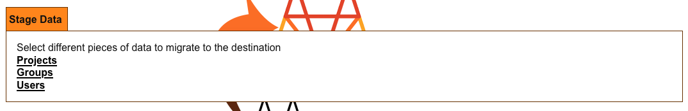

# Migrating data via Direct Transfer - Usage

## Congregate UI

Once you have Congregate configured to use Direct Transfer and all the necessary services are running,
you can now navigate to port 8000 to access the Congregate UI.

You can do the following actions in the UI when Direct Transfer is enabled in `congregate.conf`:

- List data
- Stage data
- Run a dry run migration
- Run a full migration
- Review non-sensitive information in the `congregate.conf` file

**Note:** When Direct Transfer is enabled in Congregate, listing and migrating are managed through a Celery task queue. Currently the CLI does not directly connect to Celery so one needs to trigger the listing from the UI.

### List Data

Navigate to the home page of Congregate and click the "list data" button. 


**Note:** This does not do a `DRY_RUN` like we have in the CLI. It automatically pulls from the source and updates Mongo and the various metadata JSON files

### Stage Data

Once listing is complete, you can now stage users, groups, and/or projects to migrate.
You can navigate to the different staging pages from the left navigation bar or the staging card
on the homepage:



### Migrate Data

Now that you have data staged to migrate, you can move on to running a dry-run migration and then an actual migration. Migration commands are handled in the Migrate card on the home page:


Clicking `migrate` will run a dry-run by default. You need to check the `commit` parameter to trigger an actual migration.

### Optional - Monitoring Tasks

If you want to check on the status of what is going on behind the scenes, you can navigate to the `Task Queue` on the left sidebar or go directly to the task queue dashboard which is deployed to port `5555` in the container.

## REST API

### Triggering a migration (dry-run)

To trigger a migration via direct transfer in Congregate, you make a POST call to `/direct_transfer/import` with a payload matching the payload of our bulk import API. By default, this does a dry-run so no data is migrated to the destination, but we can see a list of entities expected to be migrated. For example:

```bash
curl --request POST \
  --url http://localhost:8000/api/direct_transfer/import \
  --header 'Content-Type: application/json' \
  --data '{
      "configuration": {
        "url": "<source-url>",
        "access_token": "<source-token>"
      },
      "entities": [
        {
          "source_full_path": "<path-where-entity-will-go>",
          "source_type": "(group_entity|project_entity)",
          "destination_slug": "<group/project URL slug>",
          "destination_namespace": "<namespace>"
        }
      ]
    }'
```

You should see a response like:

```json
{
  "dry_run_data": [
    {
      "projects": [
        "path/to/project",
        ...
      ],
      "subgroups": [],
      "top_level_group": "path/to/tlg"
    }
  ],
  "status": "dry run successful"
}
```

### Triggering a migration (actual run)

If the dry-run response looks correct, you can add the `commit` parameter to the request. To trigger a migration via direct transfer in Congregate, you make a POST call to `/direct_transfer/import?commit=true` with a payload matching the payload of our bulk import API. For example:

```bash
curl --request POST \
  --url http://localhost:8000/api/direct_transfer/import?commit=true \
  --header 'Content-Type: application/json' \
  --data '{
      "configuration": {
        "url": "<source-url>",
        "access_token": "<source-token>"
      },
      "entities": [
        {
          "source_full_path": "<path-where-entity-will-go>",
          "source_type": "(group_entity|project_entity)",
          "destination_slug": "<group/project URL slug>",
          "destination_namespace": "<namespace>"
        }
      ]
    }'
```

This request will take up to a minute to finish running as the various tasks are added to the job queue.

You should see a response like:

```json
{
  "entity_ids": [
    "3f826a65-5da5-425a-a563-b6ae7137a8d1",
    "18060cd1-6123-43c6-a11f-a192623119f1",
    "d3c33d0e-43f4-43e5-8367-a421a7db1f20",
    "bee46407-e178-4885-8312-2eea8ab42a85",
    "26c79140-a9c4-4c36-a072-068f14b1d702",
    "9908bee9-5c5e-4326-8190-acd0b7dc8ca5",
    "1a8cdc7a-9a8a-4017-968e-70406738ce24",
    "8f07de4a-905a-470a-9d4f-3de143f27fb8",
    "794caefe-8138-4c10-b14e-029e6962760c",
    "e4f75aa4-4119-4258-a2be-6b18aff1716e",
    "7b9669e0-e7da-4fd6-839d-c6c991732c34",
    "b510fb34-b640-4c3e-bc26-b9befd25be52",
    "0f3afd17-a27f-4b29-89b8-f5c0b5194468",
    "338f17a3-6e90-4d60-bb76-c60a4827bb8e",
    "7411e64f-739a-4c2b-8dc5-7528c3950b22",
    "788da7cf-d005-4503-8adb-1abce5e5bd8b",
    "5d239513-6792-4aa4-a6b2-3ed3ffda1dbf",
    "d1cad0c7-9884-4225-9587-f8854b7bb570",
    "05144a7a-a41c-4833-9fbc-3836bd2c5417",
    "15821ef8-0a33-456a-90a5-b1f3ca5c727c",
    "2d8a270c-126d-4daf-aa2e-489fc114c2ff",
    "5dc4c1a5-c13b-4d45-b02b-bc90e612397b",
    "6798c262-bba5-4e5b-bbbb-725088ae8aa8",
    "d776df97-c728-49ad-8761-cc8ccc39657b"
  ],
  "overall_status_id": "6ddb8e2c-02ef-4771-bb33-dea3a312d90c",
  "status": "triggered direct transfer jobs"
}
```

Each of the entity IDs correspond to a watch job in Congregate that is polling the GitLab instance for the status of that specific entity's import.

Once the direct transfer finishes, another task is sent to the queue to handle any of our post migration tasks in Congregate like migrating CI variables, docker containers, etc.

## Monitoring Migration Status

We utilize a task queue (Celery) when migrating via direct transfer.
We send a series of tasks to a queue to process and we can monitor them through a tool called Flower.

To access flower, navigate to `http(s)://<url-where-congregate-is-running>:5555` to see a list of jobs in the queue

The `overall_status_id` in the response monitors the overall status of the migration so if that is still in a started or running state, there is still data migrating either with direct transfer or Congregate

