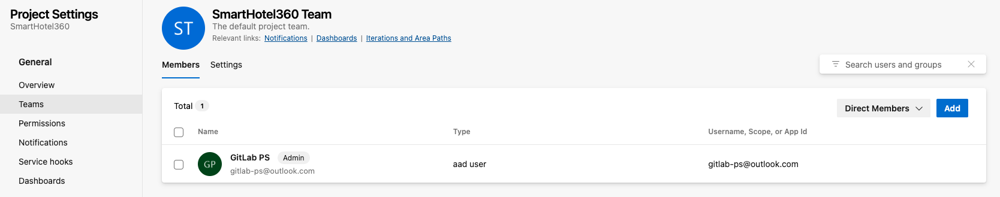

[TOC]

# Migration Wave

This runbook covers the process of migrating a wave of **projects and project repositories** from an Azure DevOps instance to GitLab self managed, Dedicated or gitlab.com instance.

## Slack channel for communication

* Customer shared channel
* For GitLab PSE, there is an internal dedicated channel for discussion and alerts

## Points of contact

* Get list of main point of contact from Customer during the Migration window

## Groups to migrate

### Legend

* :x: = not started
* :heavy_minus_sign: = in progress (optional)
* :white_check_mark: = finished

## Professional Services Steps to Complete Migration Wave

### Pre-migration checklist

* PSE conducting the migration:
  * [ ] Acquires an obfuscated (`./congregate.sh obfuscate`) Azure DevOps personal access token with owner privileges. [Reference link](https://learn.microsoft.com/en-us/azure/devops/organizations/accounts/use-personal-access-tokens-to-authenticate?view=azure-devops&tabs=Windows#create-a-pat). **Prepend `:` in ADO token when obfuscating**.
    * [ ] Steps:
      * [ ] Login with your Azure DevOps user account. User that performs migration (it's token) needs to be organisation's administrator (use builtin role in Microsoft Entra `Azure DevOps Administrator` for example)
      * [ ] In the upper-right corner of any page, click on the icon of a man with a small cogwheel, then click **Personal Access Token**.
      * [ ] In the left sidebar, click **Developer settings**.
      * [ ] In the left sidebar, under **Personal access tokens**, click **Fine-grained tokens**.
      * [ ] In the upper-right top corner of the page, find and click **New token** button.
        * Under **Name**, enter a name for the token.
        * Under **Organization**, select relevant organization.
        * Under **Expiration (UTC)**, select an expiration for the token.
        * Under **Scopes**, expand using "Show all scopes" and select checkbox with "Read" scope in order to follow principle of least privilege. Alternatively, you can use "Full access" scope.
  * [ ] Acquires an obfuscated (`./congregate.sh obfuscate`) GitLab Admin token with `api` scope. For GitLab.com Admin token, an _Issue_ in [Access request](https://gitlab.com/gitlab-com/team-member-epics/access-requests) and choosing template _Access Change Request_
  * [ ] Configures Congregate to migrate from an Azure DevOps to GitLab.com
    * [ ] Inspects and validates configured values in `data/congregate.conf`
      * **Tip:** Run `congregate validate-config` to ensure Congregate is configured properly
  * [ ] (optional) Runs `congregate clean-database --commit` to drop any previous collection(s) of users, groups and projects
    * [ ] If you are migrating from scratch add `--keys` argument to drop collection(s) of deploy keys as well

Example of `data/congregate.conf` for Azure DevOps as source:

```
...

[SOURCE]
src_type = Azure DevOps
src_hostname = https://dev.azure.com/ado-org
src_username = ado-admin
src_access_token = <obfuscated token in with prepended colon>
...

```

### User migration

Instructions for user migration collapsed by default.

#### Prepare users

* [ ] Review migration schedule (see customer migration schedule)
* [ ] Review [GitLab (file export) pre-requisites](https://docs.gitlab.com/ee/user/project/settings/import_export.html) before performing migration
  * [ ] To migrate projects from Azure DevOps, you must enable the [GitLab export as an import source](https://docs.gitlab.com/ee/administration/settings/import_and_export_settings.html#configure-allowed-import-sources). **NOTE**: "GitLab export" import source is enabled by default on GitLab.com
  * [ ] **Accounts for user contribution mapping**

    For user contribution mapping between Azure DevOps and GitLab to work:
    * An instance administrator's PAT is required for import (if service account is used, make sure scope has `admin_mode`, [see more info](https://docs.gitlab.com/user/profile/personal_access_tokens/#personal-access-token-scopes)). NB! When migrating projects by using file exports to gitlab.com, an administrator’s access token is required for user contributions to map correctly. Consider engaging Professional Services. For more information, see the [Professional Services Full Catalog](https://about.gitlab.com/services/catalog/) for user's contributions to preserve correctly.
    * The Azure DevOps user’s email address must match their GitLab email address.
    * Make sure the user is a member of one of the project's teams (either direct member of a team or via Azure Entra Group) as congregate pulls users only from `TeamName Team` (see more information about [default security groups](https://learn.microsoft.com/en-us/azure/devops/organizations/security/about-permissions?view=azure-devops&tabs=preview-page#default-security-groups)). See image below (NB! It does not necessarily have to be a member of the default Team's group, any group or even direct member, but it has to be the list of team members within the project that is being migrated).
    * Congregate relies on [mailAddress](https://learn.microsoft.com/en-us/rest/api/azure/devops/graph/users/list?view=azure-devops-rest-7.1&tabs=HTTP#graphuser) from Graph API.
    * It is possible to manually adjust members and attributes in `staged_projects.json` (add or remove) in order to match contributions better.
    
    

* [ ] When provisioning users via SAML (Just-in-Time) or SCIM [domain verification](https://docs.gitlab.com/ee/user/enterprise_user/#1-add-a-custom-domain-for-the-matching-email-domain) is recommended to avoid [user account auto-deletion on gitlab.com after 3 days](https://gitlab.com/gitlab-org/gitlab/-/issues/352514)
  * [ ] **NOTE:** Product is considering to [exclude SCIM provisioned users](https://gitlab.com/gitlab-org/gitlab/-/issues/423322). SAML Just-in-Time provisioned users still need to confirm/verify their email
* [ ] When migrating/creating users via Congregate, using the admin token, they are automatically confirmed/verified. However, they still have to link their GitLab and SAML accounts
  * To link them they have to follow [this troubleshooting scenario](https://docs.gitlab.com/ee/user/group/saml_sso/troubleshooting.html#message-there-is-already-a-gitlab-account-associated-with-this-email-address-sign-in-with-your-existing-credentials-to-connect-your-organizations-account) to reset their pwd and login to gitlab.com for the 1st time
* [ ] Login to the migration VM using `ssh -L 8000:localhost:8000 <vm_alias_ip_or_hostname>` to expose UI port `8000` outside of the docker container
  * Run `congregate ui` from the container to start the Congregate UI (limited functionality, see open [issue](https://gitlab.com/gitlab-org/professional-services-automation/tools/migration/congregate/-/issues/1183)).
* [ ] Check the status of **gitlab.com** (https://status.gitlab.com/)
  * [ ] Confirm you can reach the UI of the instance
  * [ ] Confirm you can reach the API through cURL or a REST client
  * [ ] Confirm the import (Admin) user has a spoofed SAML link in _Profile -\> Account -\> Service sign-in_
    * It has to be spoofed as we do not want the customer provisioning a gitlab.com Admin account
    * See [GitLab migration prerequisites](https://gitlab.com/gitlab-org/professional-services-automation/tools/migration/congregate/-/blob/master/runbooks/migration-pre-and-post-requisites.md) for more details
* [ ] Create a directory called "waves" in `/opt/congregate/data` in the container if it doesn't already exist
* [ ] Create a directory called `user_wave` in `/opt/congregate/data/waves` if it doesn't already exist
* [ ] List data from source
  * To list all: run `nohup congregate list > data/waves/listing.log 2>&1 &` at the beginning of the migration blackout period
  * To list data from specific ADO projects use flag `--only-specific-projects`, for example: run `nohup congregate list --only-specific-projects=<project_id_1>,<project_id_2>,<project_id_n> data/waves/listing.log 2>&1 &` at the beginning of the migration blackout period
  * If listing takes a significant amount of time, consider using the `--processes=n` flag to increase the number of parallel processing jobs. By default, the concurrency level is set to the number of available CPUs.
* [ ] Stage ALL users
  * **NOTE:** Make sure no groups and projects are staged
  * Determine (with customer) whether user ID 1 is a regular user that should be migrated
* [ ] Copy `data/staged_users.json` to `/opt/congregate/data/waves/user_wave`
* [ ] Lookup whether the staged users (emails) already exist on the destination by running `congregate search-for-staged-users` **NOTE**: Azure DevOps email (source) should match any (primary or secondary) verified/confirmed user email on destination
  * This will output a list of user metadata, based on `email`, along with other stats
  * Add argument `--table` to command to save this output to `data/user_stats.csv`
* [ ] Determine with customer how to configure:
  * [ ] `group_sso_provider` and `group_sso_provider_pattern`, if they are using SSO
  * [ ] `keep_inactive_users` (`False` by default),
    * `reset_pwd` (`True` by default),
    * `force_rand_pwd` (`False` by default)
* [ ] By default inactive users are skipped during user migration. To be sure they are removed from staged users, groups and projects run the following command:
  * [ ] Dry run: `congregate remove-inactive-users`
  * [ ] Live: `congregate remove-inactive-users --commit`
* [ ] Notify in the internal Slack channel dedicated to this migration you have completed preparation for the user wave

<details>
<summary>

#### Dry run users

</summary>

* [ ] Run the following command: `nohup congregate migrate > data/waves/user_wave/user_wave_dry_run.log 2>&1 &`
  * **NOTE:** The command assumes you have no groups or projects staged
* [ ] Confirm everything looks correct and move on to the next step in the runbook
  * Specifically, review the API requests and make sure the paths look correct.
  * If anything looks wrong in the dry run, make a note of it in the issue and reach out to `@gitlab-org/professional-services-automation/tools/migration` for review. Do not proceed with the migration if the dry run data looks incorrect. If this is incorrect, the data we send will be incorrect.
* [ ] Copy `data/results/dry_run_user_migration.json` to `/opt/congregate/data/waves/user_wave/` and attach to this issue
* [ ] Notify in the internal Slack channel dedicated to this migration you have completed dry run for the user wave

####

#### Migrate users

* [ ] Notify in the internal Slack channel dedicated to this migration you are starting the user migration wave
* [ ] Notify the customer in the customer-facing Slack channel you are starting the user migration wave
* [ ] Run the following command `nohup congregate migrate --commit > data/waves/user_wave/user_wave.log 2>&1 &`
* [ ] Monitor the wave periodically by running `tail -f data/waves/user_wave/user_wave.log`
* [ ] Copy the following files to `/opt/congregate/data/waves/user_wave/` and attach to this issue:
  * `data/logs/congregate.log`
  * `data/logs/audit.log`
  * `data/results/user_migration_results.json`
  * `data/waves/user_wave/user_wave.log`

</details>

### Group and project migration

* Azure DevOps project becomes GitLab [Sub-Group](https://docs.gitlab.com/user/group/subgroups/) (or top level group if self-managed or dedicated is used as a target)
* Azure DevOps repository becomes [GitLab Project](https://docs.gitlab.com/user/project/) based on Azure DevOps repository Git data.
    **NOTE:** We currently only support Git type of Azure DevOps (TFVC support is currently **not** available. See [open issue](https://gitlab.com/gitlab-org/professional-services-automation/tools/migration/congregate/-/issues/1248)).

Known issues:

* CSV staging is not fully supported (open [issue](https://gitlab.com/gitlab-org/professional-services-automation/tools/migration/congregate/-/issues/1120)).

#### Staging projects

* [ ] Open `data/projects.json` and find out IDs of projects to stage. **NOTE**, Azure DevOps uses [Universally Unique Identifier (UUID)](https://en.wikipedia.org/wiki/Universally_unique_identifier) and therefore IDs in all listed objects use this format.
* [ ] Run the following command to stage projects: `congregate stage-projects project_id_1 project_id_2 project_id_n --commit` (replace `project_id_1`, `project_id_2`, `project_id_n` with the values noted in previous step). You can pass as many project IDs as you want, keep them space separated as shown in the command earlier.

#### Staging groups

* [ ] Open `data/groups.json` and find out IDs of groups to stage. **NOTE**, Azure DevOps uses [Universally Unique Identifier (UUID)](https://en.wikipedia.org/wiki/Universally_unique_identifier) and therefore IDs in all listed objects use this format.
* [ ] Run the following command to stage projects: `congregate stage-groups group_id_1 group_id_2 group_id_n --commit` (replace `group_id_1`, `group_id_2`, `group_id_n` with the values noted in previous step). You can pass as many group IDs as you want, keep them space separated as shown in the command earlier.

#### Dry run projects

* [ ] Run the following command: `nohup congregate migrate --skip-users --skip-groups > data/waves/wave_<insert_wave_number>/wave_<insert_wave_number>_dry_run.log 2>&1 &`
* [ ] Confirm everything looks correct and move on to the next step in the runbook
  * Specifically, review the API requests and make sure the paths look correct. For example, make sure any parent IDs, target namespace or other namespaces are matching the parent ID and parent namespaces we have specified in the congregate config.
  * If anything looks wrong in the dry run, make a note of it in the issue and reach out to `@gitlab-org/professional-services-automation/tools/migration` for review. Do not proceed with the migration if the dry run data looks incorrect. If this is incorrect, the data we send will be incorrect.
* [ ] Copy `data/results/dry_run_*_migration.json` to `/opt/congregate/data/waves/wave_<insert_wave_number>/` and attach to this issue
* [ ] Notify in the internal Slack channel dedicated to this migration you have completed dry run for the wave

#### Dry run groups

* [ ] Run the following command: `nohup congregate migrate --skip-users --skip-projects > data/waves/wave_<insert_wave_number>/wave_<insert_wave_number>_dry_run.log 2>&1 &`
* [ ] Confirm everything looks correct and move on to the next step in the runbook
  * Specifically, review the API requests and make sure the paths look correct. For example, make sure any parent IDs, target namespace or other namespaces are matching the parent ID and parent namespaces we have specified in the congregate config.
  * If anything looks wrong in the dry run, make a note of it in the issue and reach out to `@gitlab-org/professional-services-automation/tools/migration` for review. Do not proceed with the migration if the dry run data looks incorrect. If this is incorrect, the data we send will be incorrect.
* [ ] Copy `data/results/dry_run_*_migration.json` to `/opt/congregate/data/waves/wave_<insert_wave_number>/` and attach to this issue
* [ ] Notify in the internal Slack channel dedicated to this migration you have completed dry run for the wave

#### Migrate projects

* [ ] Notify in the internal Slack channel dedicated to this migration you are starting the migration wave
* [ ] Notify the customer in the customer-facing Slack channel you are starting the migration wave
* [ ] Run the following command `nohup congregate migrate --skip-users --skip-groups --commit > data/waves/wave_<insert_wave_number>/wave<insert-wave-here>.log 2>&1 &`
* [ ] Monitor the wave periodically by running `tail -f data/waves/wave_<insert_wave_number>/wave<insert-wave-here>.log`
* [ ] Copy the following files to `/opt/congregate/data/waves/wave_<insert_wave_number>/` and attach to this issue:
  * `data/logs/congregate.log`
  * `data/logs/audit.log`
  * `data/results/group_migration_results.json`
  * `data/results/project_migration_results.json`
  * `data/logs/import_failed_relations.json`
  * `data/waves/wave_<insert_wave_number>/wave<insert-wave-here>.log`congregate/data/waves/wave\_/\`
* [ ] Inspect `data/logs/import_failed_relations.json` for any project import failed relations (missing feature info)
  * In case of missing MRs that are critical to the customer and business:
    * [ ] Stage and rollback projects with critical failed relations
      * **NOTE:** `--skip-users` and `--skip-groups`
    * [ ] Repeat [migration](#groups-and-projects-migration)
    * [ ] Once complete, and in case of consistently missing info, discuss and request verbal or written sign-off from customer
      * [ ] Otherwise [rollback](#rollback) the entire wave and reschedule
* [ ] Inspect [Kibana](https://log.gprd.gitlab.net/app/discover) logs for failed group and project membership
  * Adjust the time frame to the migration period
  * Query `pubsub-sidekiq-inf-gprd*` for `json.message: "[Project/Group Import] Member addition failed" AND json.root_namespace_id: "<parent-group-id>"`
  * (optional) Add additional fields to the query .e.g:
    * `json.message`
    * `json.importable_type`
    * `json.user_id`
    * `json.access_level`
* [ ] Inspect [Kibana](https://log.gprd.gitlab.net/app/discover) logs for failed group and project imports
  * Adjust the time frame to the migration period
  * Query `pubsub-sidekiq-inf-gprd*` for `json.class: "RepositoryImportWorker" AND json.meta.remote_ip: "<migration-vm-ip>"`
    * (optional) Add fields `json.meta.project` and `json.job_status`
  * Query `pubsub-sidekiq-inf-gprd*` for `json.class: "GroupImportWorker" AND json.meta.remote_ip: "<migration-vm-ip>"`
    * (optional) Add field `json.job_status`
  * For more options checkout the [Support workflow for import errors](https://about.gitlab.com/handbook/support/workflows/kibana.html#import-errors)
* [ ] Inspect [Kibana](https://log.gprd.gitlab.net/app/discover) logs for other import errors
  * Adjust the time frame to the migration period
  * Add `json.severity: ERROR`
  * Query `pubsub-sidekiq-inf-gprd*` for `json.extra.sidekiq.meta.remote_ip : "<migration-vm-ip>"`
    * (optional) Add additional fields to the query .e.g:
      * `json.extra.sidekiq.class`
      * `json.exception.message`
      * `json.exception.class`
      * `json.extra.relation_name`

#### Migrate groups

* [ ] Notify in the internal Slack channel dedicated to this migration you are starting the migration wave
* [ ] Notify the customer in the customer-facing Slack channel you are starting the migration wave
* [ ] Run the following command `nohup congregate migrate --skip-users --skip-projects --commit > data/waves/wave_<insert_wave_number>/wave<insert-wave-here>.log 2>&1 &`
* [ ] Monitor the wave periodically by running `tail -f data/waves/wave_<insert_wave_number>/wave<insert-wave-here>.log`
* [ ] Copy the following files to `/opt/congregate/data/waves/wave_<insert_wave_number>/` and attach to this issue:
  * `data/logs/congregate.log`
  * `data/logs/audit.log`
  * `data/results/group_migration_results.json`
  * `data/results/project_migration_results.json`
  * `data/logs/import_failed_relations.json`
  * `data/waves/wave_<insert_wave_number>/wave<insert-wave-here>.log`congregate/data/waves/wave\_/\`
* [ ] Inspect `data/logs/import_failed_relations.json` for any project import failed relations (missing feature info)
  * In case of missing MRs that are critical to the customer and business:
    * [ ] Stage and rollback projects with critical failed relations
      * **NOTE:** `--skip-users` and `--skip-projects`
    * [ ] Repeat [migration](#groups-and-projects-migration)
    * [ ] Once complete, and in case of consistently missing info, discuss and request verbal or written sign-off from customer
      * [ ] Otherwise [rollback](#rollback) the entire wave and reschedule
* [ ] Inspect [Kibana](https://log.gprd.gitlab.net/app/discover) logs for failed group and project membership
  * Adjust the time frame to the migration period
  * Query `pubsub-sidekiq-inf-gprd*` for `json.message: "[Project/Group Import] Member addition failed" AND json.root_namespace_id: "<parent-group-id>"`
  * (optional) Add additional fields to the query .e.g:
    * `json.message`
    * `json.importable_type`
    * `json.user_id`
    * `json.access_level`
* [ ] Inspect [Kibana](https://log.gprd.gitlab.net/app/discover) logs for failed group and project imports
  * Adjust the time frame to the migration period
  * Query `pubsub-sidekiq-inf-gprd*` for `json.class: "RepositoryImportWorker" AND json.meta.remote_ip: "<migration-vm-ip>"`
    * (optional) Add fields `json.meta.project` and `json.job_status`
  * Query `pubsub-sidekiq-inf-gprd*` for `json.class: "GroupImportWorker" AND json.meta.remote_ip: "<migration-vm-ip>"`
    * (optional) Add field `json.job_status`
  * For more options checkout the [Support workflow for import errors](https://about.gitlab.com/handbook/support/workflows/kibana.html#import-errors)
* [ ] Inspect [Kibana](https://log.gprd.gitlab.net/app/discover) logs for other import errors
  * Adjust the time frame to the migration period
  * Add `json.severity: ERROR`
  * Query `pubsub-sidekiq-inf-gprd*` for `json.extra.sidekiq.meta.remote_ip : "<migration-vm-ip>"`
    * (optional) Add additional fields to the query .e.g:
      * `json.extra.sidekiq.class`
      * `json.exception.message`
      * `json.exception.class`
      * `json.extra.relation_name`

#### Migrate groups and projects

* [ ] Notify in the internal Slack channel dedicated to this migration you are starting the migration wave
* [ ] Notify the customer in the customer-facing Slack channel you are starting the migration wave
* [ ] Run the following command `nohup congregate migrate --skip-users --commit > data/waves/wave_<insert_wave_number>/wave<insert-wave-here>.log 2>&1 &`
* [ ] Monitor the wave periodically by running `tail -f data/waves/wave_<insert_wave_number>/wave<insert-wave-here>.log`
* [ ] Copy the following files to `/opt/congregate/data/waves/wave_<insert_wave_number>/` and attach to this issue:
  * `data/logs/congregate.log`
  * `data/logs/audit.log`
  * `data/results/group_migration_results.json`
  * `data/results/project_migration_results.json`
  * `data/logs/import_failed_relations.json`
  * `data/waves/wave_<insert_wave_number>/wave<insert-wave-here>.log`congregate/data/waves/wave\_/\`
* [ ] Inspect `data/logs/import_failed_relations.json` for any project import failed relations (missing feature info)
  * In case of missing MRs that are critical to the customer and business:
    * [ ] Stage and rollback projects with critical failed relations
      * **NOTE:** `--skip-users`
    * [ ] Repeat [migration](#groups-and-projects-migration)
    * [ ] Once complete, and in case of consistently missing info, discuss and request verbal or written sign-off from customer
      * [ ] Otherwise [rollback](#rollback) the entire wave and reschedule
* [ ] Inspect [Kibana](https://log.gprd.gitlab.net/app/discover) logs for failed group and project membership
  * Adjust the time frame to the migration period
  * Query `pubsub-sidekiq-inf-gprd*` for `json.message: "[Project/Group Import] Member addition failed" AND json.root_namespace_id: "<parent-group-id>"`
  * (optional) Add additional fields to the query .e.g:
    * `json.message`
    * `json.importable_type`
    * `json.user_id`
    * `json.access_level`
* [ ] Inspect [Kibana](https://log.gprd.gitlab.net/app/discover) logs for failed group and project imports
  * Adjust the time frame to the migration period
  * Query `pubsub-sidekiq-inf-gprd*` for `json.class: "RepositoryImportWorker" AND json.meta.remote_ip: "<migration-vm-ip>"`
    * (optional) Add fields `json.meta.project` and `json.job_status`
  * Query `pubsub-sidekiq-inf-gprd*` for `json.class: "GroupImportWorker" AND json.meta.remote_ip: "<migration-vm-ip>"`
    * (optional) Add field `json.job_status`
  * For more options checkout the [Support workflow for import errors](https://about.gitlab.com/handbook/support/workflows/kibana.html#import-errors)
* [ ] Inspect [Kibana](https://log.gprd.gitlab.net/app/discover) logs for other import errors
  * Adjust the time frame to the migration period
  * Add `json.severity: ERROR`
  * Query `pubsub-sidekiq-inf-gprd*` for `json.extra.sidekiq.meta.remote_ip : "<migration-vm-ip>"`
    * (optional) Add additional fields to the query .e.g:
      * `json.extra.sidekiq.class`
      * `json.exception.message`
      * `json.exception.class`
      * `json.extra.relation_name`

### Post Migration of Failed Groups and Projects

<details>
<summary>Instructions for post migration of failed groups and projects collapsed by default.</summary>

#### Migration of Failed Groups and Projects

For each migration attempt check if any project or group imports failed or have imported with failed status.

* [ ] Reach out to `Support` to delete the failed/partially imported projects. Provide the full path to the project. provided in the project migration results
* [ ] Once the projects are confirmed deleted, prepare to migrate them again.
* [ ] If projects or groups are missing, confirm the projects and groups have successfully exported and confirm they don't actually exist on the destination instance
  * To confirm the exports have successfully exported, review the contents of `/opt/congregate/downloads` or the S3 bucket defined in the configuration. Make sure no export archive has a size of 42 bytes. That means the export archive is invalid.
  * To confirm the projects or groups don't actually exist on the destination instance, compare the results of the diff report and manually check where the project or group should be located.
  * To confirm the projects or groups don't actually exist on the destination instance, you may also `dry-run` a wave.
    * You can also search for the project with an API request to `/projects?search=<project-name>`
    * You can also search for the groups with an API request to `/groups?search=<group-name>` or `/groups/<url-encoded-full-path>`
* [ ] Stage _only_ those groups and projects and go through this runbook again, this time with the following command for the migration stage: `nohup ./congregate.sh migrate --skip-users --skip-group-export --skip-project-export --commit > data/waves/wave_<insert_wave_number>/wave<insert-wave-here>_attempt<insert-attempt>.log 2>&1 &`
  * [ ] If staging by group make sure to stage all sub-groups as well
  * [ ] If only sub-groups are staged make sure to add `--subgroups-only`
* [ ] Monitor the wave periodically by running `tail -f data/waves/wave_<insert_wave_number>/wave<insert-wave-here>_attempt<insert-attempt>.log`
* [ ] Notify in the internal Slack channel dedicated to this migration the migration has finished
* [ ] Notify the customer in the customer-facing Slack channel the migration wave has finished
* [ ] Copy the following files to `/opt/congregate/data/waves/wave_<insert_wave_number>/` and attach to this issue:
  * `data/logs/congregate.log`
  * `data/logs/audit.log`
  * `data/results/group_migration_results.json`
  * `data/results/project_migration_results.json`
  * `data/logs/import_failed_relations.json`
  * `data/waves/wave_<insert_wave_number>/wave<insert-wave-here>.log`

### Post Migration of Failed User, Group and Project Info

* [ ] Inspect logs (and/or Slack) for failed migrations of single user, group and project features - everything Congregate additionally migrates after a user is created i.e. group and/or project imported
* [ ] In case of unexpected errors with the migration of post-import data (SSH keys, variables, reigistries, etc.):
  * [ ] Confirm those users/groups/projects are staged
  * [ ] Run `nohup ./congregate.sh migrate --only-post-migration-info --commit > data/waves/wave_<insert_wave_number>/wave<insert-wave-here>_attempt<insert-attempt>_post_migration.log 2>&1 &` to migrate any post-migration data
    * **NOTE:** `--only-post-migration-info` will implicitly skip group and project exports, but not imports and user creation

</details>

### Rollback

<details>
<summary>

If **any** data was migrated incorrectly (i.e. to the wrong namespace), you **must** rollback the migration wave **completely**. Section collapsed by default.

</summary>

#### Users

* [ ] Notify in the internal Slack channel dedicated to this migration you are running a rollback due to an issue with the migration
* [ ] Dry run `nohup ./congregate.sh rollback --hard-delete --skip-groups --skip-projects > data/waves/user_wave/rollback_dry_run.log 2>&1 &`
  * **NOTE:** `--hard-delete` will also remove user contributions
* [ ] Live run `nohup ./congregate.sh rollback --hard-delete --skip-groups --skip-projects --commit > data/waves/user_wave/rollback.log 2>&1 &`
* [ ] Copy `data/logs/congregate.log` and `data/logs/audit.log` to `/opt/congregate/data/waves/user_wave/`
* [ ] Post a comment describing the reason for the rollback and attach the rollback log and `data/logs/audit.log`
* [ ] Follow these [instructions in the handbook](https://about.gitlab.com/handbook/engineering/security/#engaging-the-security-on-call) and link to this issue.

#### Groups and projects

* [ ] Make sure groups and projects can be immediately deleted
  * **Group Settings:** _Group -\> Settings -\> General -\> Permissions_
  * **Instance Settings:** _Admin Area -\> Settings -\> General -\> Visibility and access controls_
* [ ] If not, inform the Support Engineer with Rails Console access in order to delete them before proceeding. If there is no existing Support Engineer assigned to the issue, reach out in `#support_lab-com` Slack channel with the request details and link to a comment that lists the subgroups that require deletion.
* [ ] Notify in the internal Slack channel dedicated to this migration you are running a rollback due to an issue with the migration
* [ ] Dry run `nohup ./congregate.sh rollback --skip-users > data/waves/wave_<insert_wave_number>/rollback_dry_run.log 2>&1 &`
* [ ] Live run `nohup ./congregate.sh rollback --skip-users --commit > data/waves/wave_<insert_wave_number>/rollback.log 2>&1 &`
* [ ] Copy `data/logs/congregate.log` and `data/logs/audit.log` to `/opt/congregate/data/waves/wave_<insert_wave_number>/`
* [ ] Post a comment describing the reason for the rollback and attach the rollback log and `data/logs/audit.log`
* [ ] Follow these [instructions in the handbook](https://about.gitlab.com/handbook/engineering/security/#engaging-the-security-on-call) and link to this issue.

</details>

/confidential